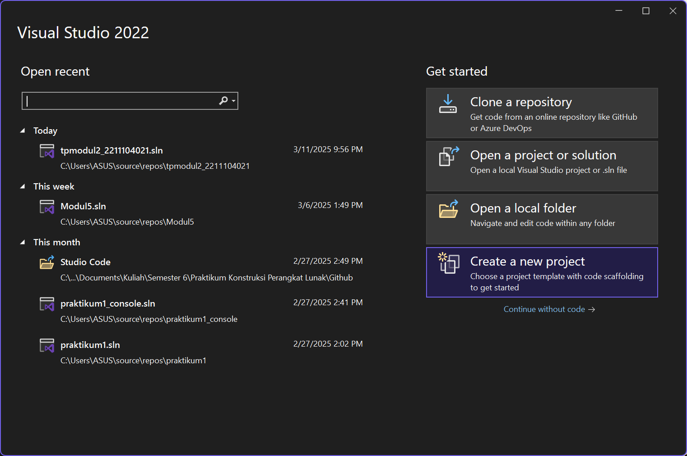
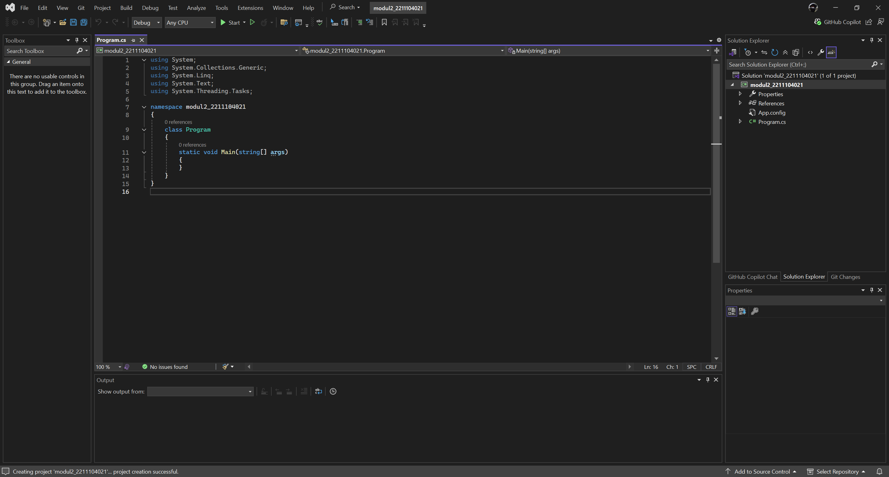

<div align="center">
JURNAL <br>
KONSTRUKSI PERANGKAT LUNAK <br>
<br>
MODUL I <br>
<!-- JUDUL -->
 <br>


<br>

Disusun Oleh: <br>
Wahyu Isnantia Qodri Ghozali/2211104021 <br>
SE-06-01 <br>

<br>

Asisten Praktikum : <br>
Naufal El Kamil Aditya Pratama Rahman <br>
Imelda Alfina Palupi Dewi <br>

<br>

Dosen Pengampu : <br>
Yudha Islami Sulistya, S.Kom., M.Cs <br>

<br>

PROGRAM STUDI S1 REKAYASSA PERANGKAT LUNAK <br>
FAKULTAS INFORMATIKA <br> 
TELKOM UNIVERSITY PURWOKERTO <br>

</div>

## 1. Membuat project console/tanpa GUI






## 2. Menambahkan kode implementasi


### Source code
```
using System;
using System.Collections.Generic;
using System.Linq;
using System.Text;
using System.Threading.Tasks;

class Program
{
    static void Main()
    {
        // Bagian A: Menerima input nama praktikan
        Console.Write("Masukkan nama Anda: ");
        string nama = Console.ReadLine();
        Console.WriteLine($"Selamat datang, {nama}!");

        // Bagian B: Array dengan aturan khusus
        int[] array = new int[20];
        for (int i = 0; i < array.Length; i++)
        {
            array[i] = i;
            if (i % 2 == 0 && i % 3 == 0)
                Console.WriteLine($"{i} #$#$");
            else if (i % 2 == 0)
                Console.WriteLine($"{i} ##");
            else if (i % 3 == 0)
                Console.WriteLine($"{i} $$");
            else
                Console.WriteLine(i);
        }

        // Bagian C: Pengecekan bilangan prima
        Console.Write("Masukkan angka (1-10000): ");
        int nilaiInt = Convert.ToInt32(Console.ReadLine());

        if (IsPrima(nilaiInt))
            Console.WriteLine($"Angka {nilaiInt} merupakan bilangan prima");
        else
            Console.WriteLine($"Angka {nilaiInt} bukan merupakan bilangan prima");
    }

    static bool IsPrima(int angka)
    {
        if (angka < 2) return false;
        for (int i = 2; i * i <= angka; i++)
        {
            if (angka % i == 0) return false;
        }
        return true;
    }
}
```

### Output


### Penjelasan
Di `Main()` akan menerima input nama praktikan, lalu mencetak sapaan selamat datang. Di array `array[20]` akan diisi dengan nilai sesuai indeksnya, lalu dilakukan iterasi untuk mencetak elemen dengan tambahan simbol jika indeksnya kelipatan 2, 3, atau keduanya. Di bagian terakhir, program meminta input angka, mengonversinya ke `int`, lalu mengecek apakah itu bilangan prima menggunakan fungsi `IsPrima()`, yang memeriksa pembagian angka dari 2 hingga akar kuadratnya.