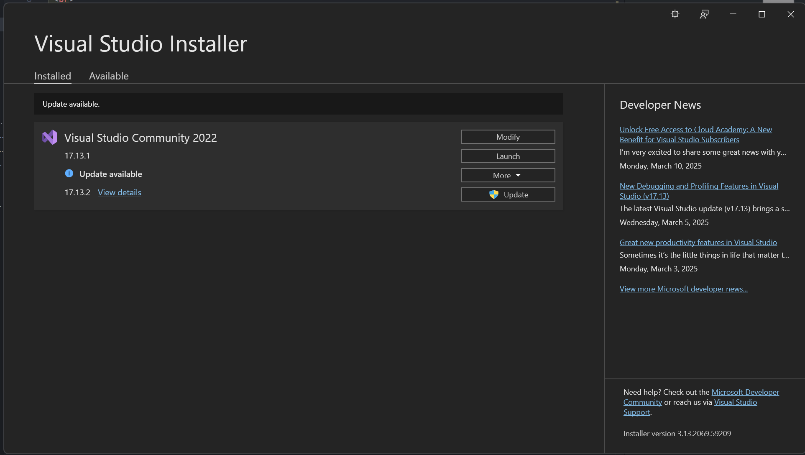

# Cover
<div align="center">
TUGAS PENDAHULUAN <br>
KONSTRUKSI PERANGKAT LUNAK <br>
<br>
MODUL II <br>
<!-- JUDUL -->
 <br>


<br>

Disusun Oleh: <br>
Wahyu Isnantia Qodri Ghozali/2211104021 <br>
SE-06-01 <br>

<br>

Asisten Praktikum : <br>
Naufal El Kamil Aditya Pratama Rahman <br>
Imelda Alfina Palupi Dewi <br>

<br>

Dosen Pengampu : <br>
Yudha Islami Sulistya, S.Kom., M.Cs <br>

<br>

PROGRAM STUDI S1 REKAYASSA PERANGKAT LUNAK <br>
FAKULTAS INFORMATIKA <br> 
TELKOM UNIVERSITY PURWOKERTO <br>

</div>

## 1. Bukti menginstall Visual Studio


## 2. Membuat project console/tanpa GUI


## 3. Implementasi Kode


### Source Code
```
using System;
using System.Collections.Generic;
using System.Linq;
using System.Text;
using System.Threading.Tasks;
class Program
{
    static void Main()
    {
        // Bagian A: Menerima input satu karakter
        Console.Write("Masukkan satu huruf: ");
        char huruf = Char.ToUpper(Console.ReadKey().KeyChar);
        Console.WriteLine();

        // Mengecek apakah huruf adalah vokal atau konsonan
        if (huruf == 'A' || huruf == 'I' || huruf == 'U' || huruf == 'E' || huruf == 'O')
        {
            Console.WriteLine($"Huruf {huruf} merupakan huruf vokal");
        }
        else if (Char.IsLetter(huruf))
        {
            Console.WriteLine($"Huruf {huruf} merupakan huruf konsonan");
        }
        else
        {
            Console.WriteLine("Input bukan huruf yang valid.");
        }

        // Bagian B: Array bilangan genap
        int[] bilanganGenap = { 2, 4, 6, 8, 10 };
        for (int i = 0; i < bilanganGenap.Length; i++)
        {
            Console.WriteLine($"Angka genap {i + 1} : {bilanganGenap[i]}");
        }
    }
}
```

### Output 


### Penjelasan
Di `Main()` akan menerima input huruf, mengubahnya jadi kapital, lalu mengecek apakah vokal atau konsonan dan mencetak hasilnya. Di array `bilanganGenap` akan menyimpan lima angka genap, lalu perulangan `for` akan mencetak tiap elemennya.