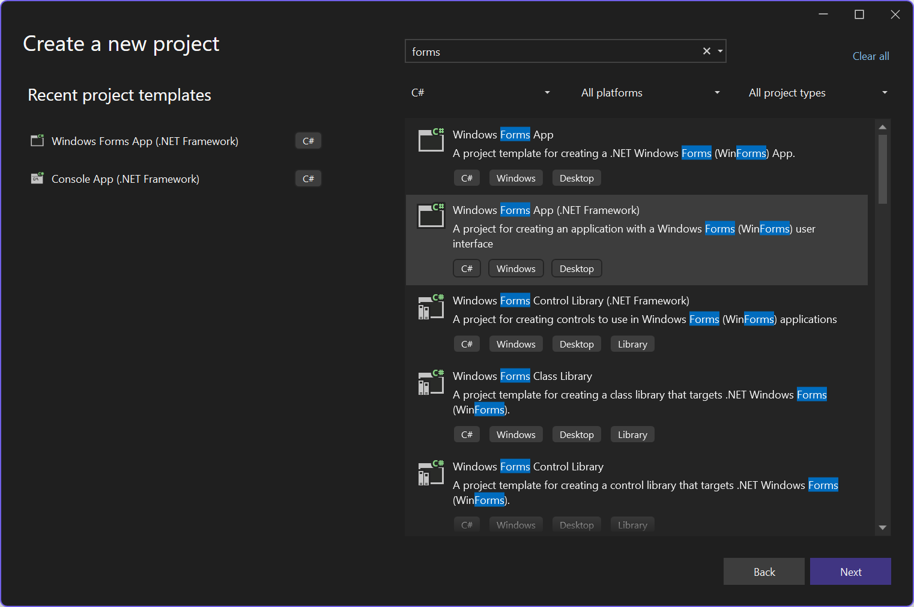
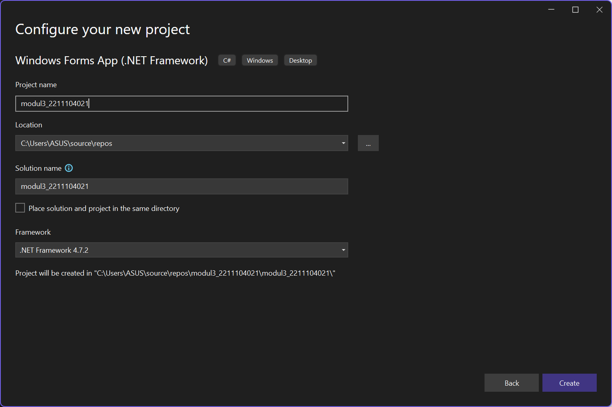
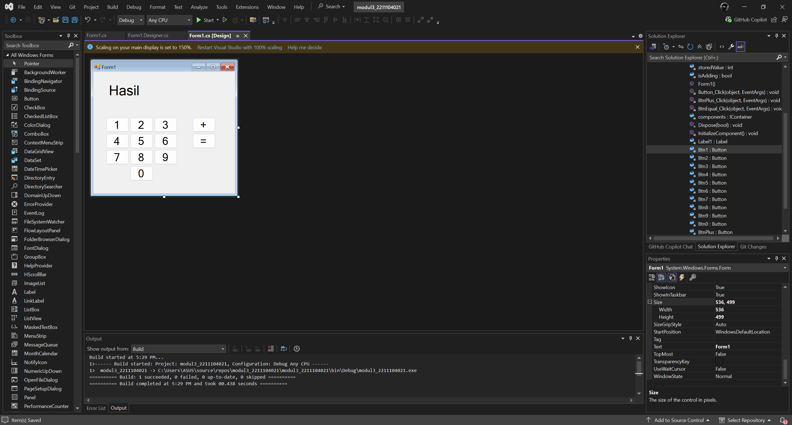
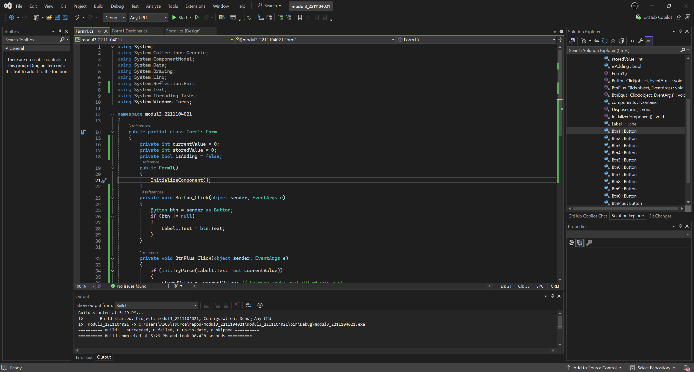
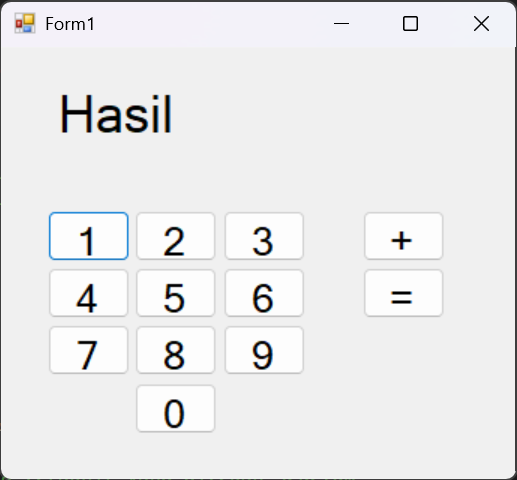
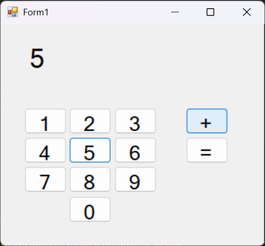
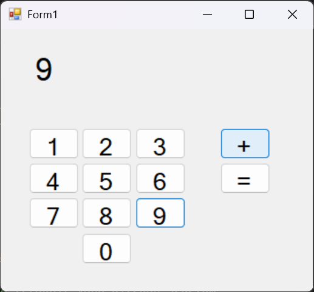
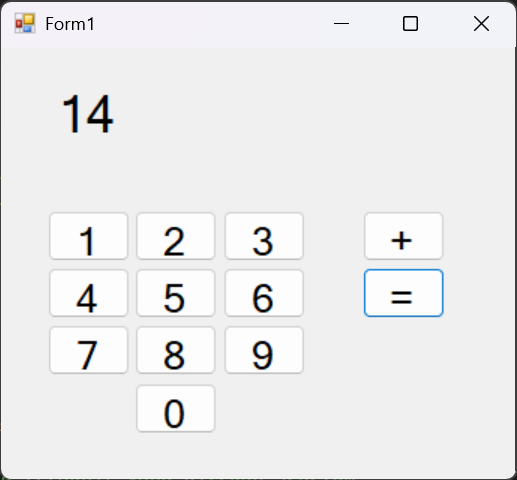

<div align="center">
JURNAL <br>
KONSTRUKSI PERANGKAT LUNAK <br>
<br>
MODUL III <br>
<!-- JUDUL -->
 <br>


<br>

Disusun Oleh: <br>
Wahyu Isnantia Qodri Ghozali/2211104021 <br>
SE-06-01 <br>

<br>

Asisten Praktikum : <br>
Naufal El Kamil Aditya Pratama Rahman <br>
Imelda Alfina Palupi Dewi <br>

<br>

Dosen Pengampu : <br>
Yudha Islami Sulistya, S.Kom., M.Cs <br>

<br>

PROGRAM STUDI S1 REKAYASSA PERANGKAT LUNAK <br>
FAKULTAS INFORMATIKA <br> 
TELKOM UNIVERSITY PURWOKERTO <br>

</div>

## 1. Membuat Project Baru



## 2. Menambahkan GUI


## 3. Implementasi Kode


### Source Code
```
using System;
using System.Collections.Generic;
using System.ComponentModel;
using System.Data;
using System.Drawing;
using System.Linq;
using System.Reflection.Emit;
using System.Text;
using System.Threading.Tasks;
using System.Windows.Forms;

namespace modul3_2211104021
{
    public partial class Form1: Form
    {
        private int currentValue = 0;
        private int storedValue = 0;
        private bool isAdding = false;
        public Form1()
        {
            InitializeComponent();
        }
        private void Button_Click(object sender, EventArgs e)
        {
            Button btn = sender as Button;
            if (btn != null)
            {
                Label1.Text = btn.Text;
            }
        }

        private void BtnPlus_Click(object sender, EventArgs e)
        {
            if (int.TryParse(Label1.Text, out currentValue))
            {
                storedValue += currentValue; // Nyimpen angka buat ditambahin nanti
                Label1.Text = ""; // Reset label buat input angka berikutnya
                isAdding = true;
            }
        }


        private void BtnEqual_Click(object sender, EventArgs e)
        {
            if (int.TryParse(Label1.Text, out currentValue) && isAdding)
            {
                storedValue += currentValue; // Nambahin angka terakhir yang ditekan sebelum "="
                Label1.Text = storedValue.ToString(); // Tampilkan hasil
                storedValue = 0; // Reset nilai buat operasi selanjutnya
                isAdding = false;
            }
        }
    }
}
```

### Output

 <br>





### Penjelasan
Di file `Form1.cs` akan dibuat tiga variabel global: `currentValue` untuk menyimpan angka yang sedang diketik, `storedValue` untuk menyimpan angka sebelumnya, dan `isAdding` untuk menandai apakah operasi penjumlahan sedang berlangsung. Di `Button_Click` akan menambahkan angka ke `label1`. Di `BtnPlus_Click` akan mengambil angka dari `label1`, menambahkannya ke `storedValue`, lalu mengosongkan label untuk angka berikutnya. Di `BtnEqual_Click` akan menjumlahkan angka terakhir yang diketik dengan `storedValue`, menampilkan hasilnya di `label1`, lalu mereset nilai untuk operasi selanjutnya.
