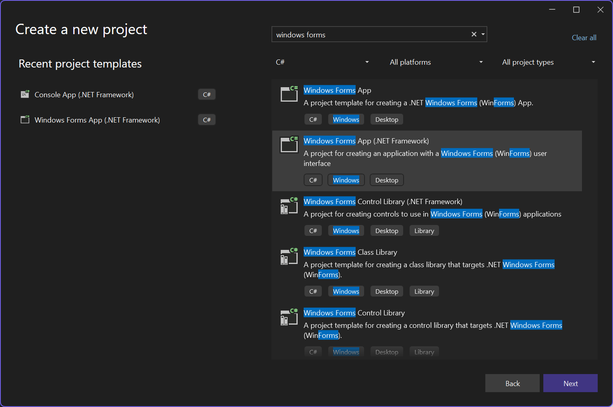
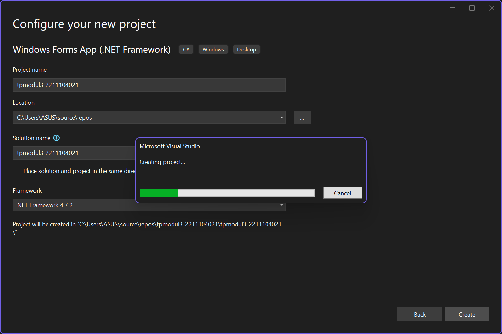
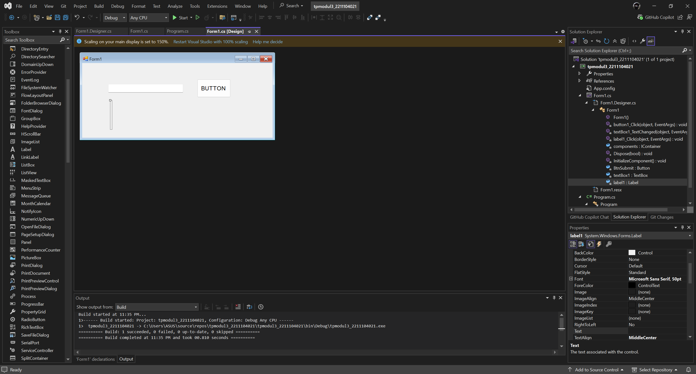
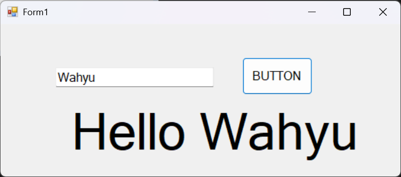

<div align="center">
TUGAS PENDAHULUAN <br>
KONSTRUKSI PERANGKAT LUNAK <br>
<br>
MODUL II <br>
<!-- JUDUL -->
 <br>


<br>

Disusun Oleh: <br>
Wahyu Isnantia Qodri Ghozali/2211104021 <br>
SE-06-01 <br>

<br>

Asisten Praktikum : <br>
Naufal El Kamil Aditya Pratama Rahman <br>
Imelda Alfina Palupi Dewi <br>

<br>

Dosen Pengampu : <br>
Yudha Islami Sulistya, S.Kom., M.Cs <br>

<br>

PROGRAM STUDI S1 REKAYASSA PERANGKAT LUNAK <br>
FAKULTAS INFORMATIKA <br> 
TELKOM UNIVERSITY PURWOKERTO <br>

</div>

## 1. Membuat Project Baru



## 2. Membuat GUI


## 3. Implementasi Kode
### Source Code Form1.cs
```
using System;
using System.Collections.Generic;
using System.ComponentModel;
using System.Data;
using System.Drawing;
using System.Linq;
using System.Text;
using System.Threading.Tasks;
using System.Windows.Forms;

namespace tpmodul3_2211104021
{
    public partial class Form1 : Form
    {
        public Form1()
        {
            InitializeComponent();
        }

        private void button1_Click(object sender, EventArgs e)
        {
            label1.Text = $"Hello {textBox1.Text}";
        }

        private void textBox1_TextChanged(object sender, EventArgs e)
        {
        }

        private void label1_Click(object sender, EventArgs e)
        {
        }
    }
}
```

### Output 

