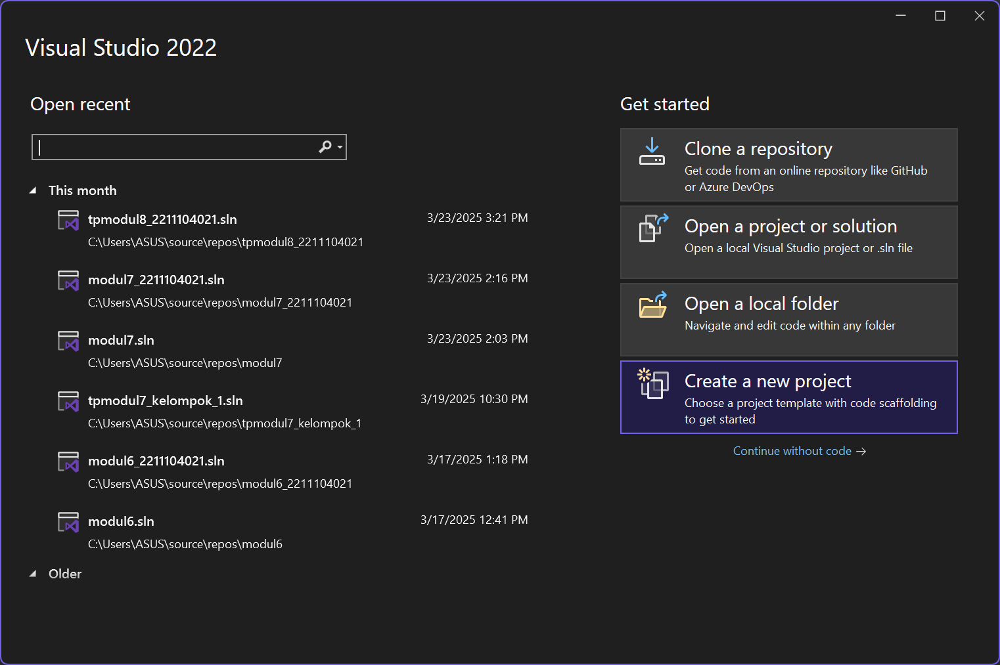
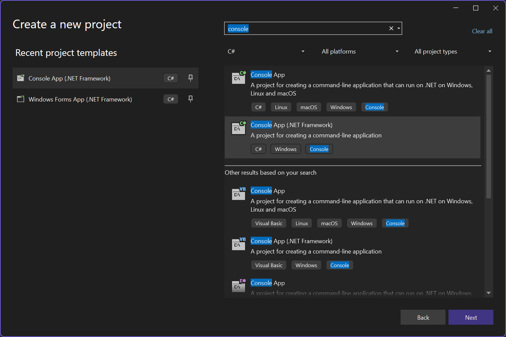
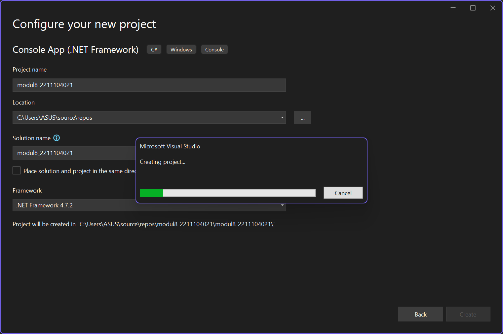
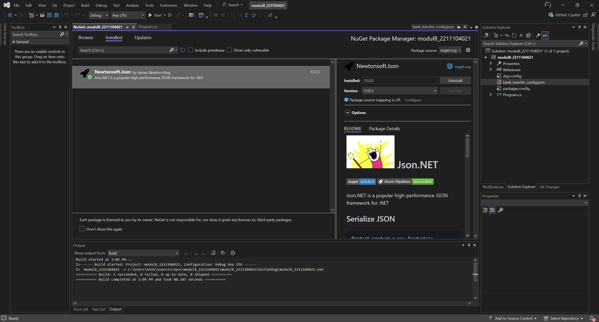
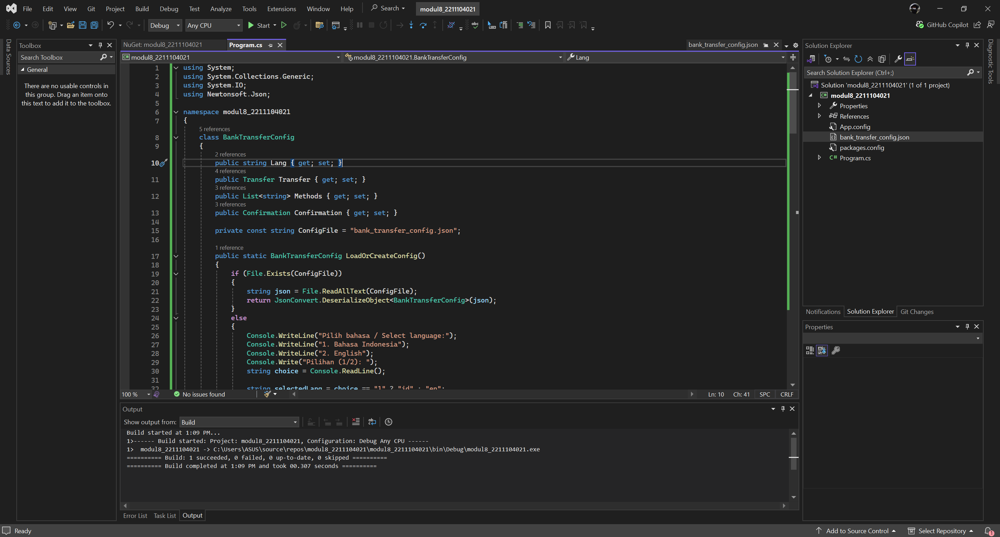
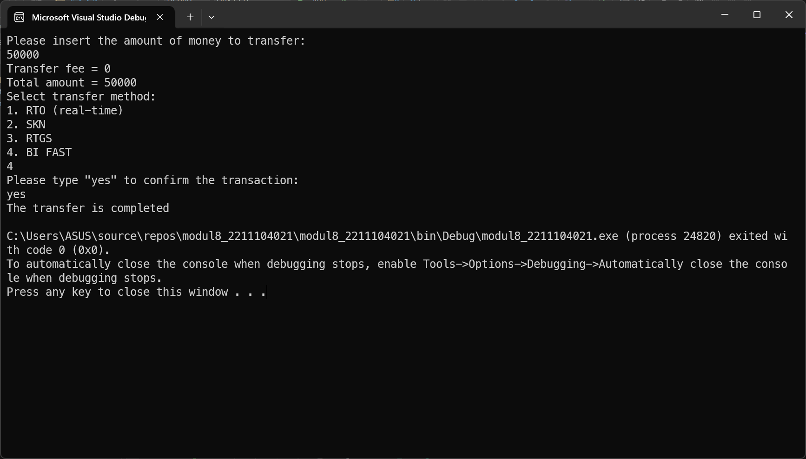

<div align="center">
JURNAL <br>
KONSTRUKSI PERANGKAT LUNAK <br>
<br>
MODUL VIII <br>
<!-- JUDUL -->
 <br>


<br>

Disusun Oleh: <br>
Wahyu Isnantia Qodri Ghozali/2211104021 <br>
SE-06-01 <br>

<br>

Asisten Praktikum : <br>
Naufal El Kamil Aditya Pratama Rahman <br>
Imelda Alfina Palupi Dewi <br>

<br>

Dosen Pengampu : <br>
Yudha Islami Sulistya, S.Kom., M.Cs <br>

<br>

PROGRAM STUDI S1 REKAYASSA PERANGKAT LUNAK <br>
FAKULTAS INFORMATIKA <br> 
TELKOM UNIVERSITY PURWOKERTO <br>

</div>

## 1. Membuat Projek Baru




### Menginstall Nu-Get Newtonsoft JSON


## 2. Implementasi Kode


#### Source Code `Program.cs`:
```
using System;
using System.Collections.Generic;
using System.IO;
using Newtonsoft.Json;

namespace modul8_2211104021
{
    class BankTransferConfig
    {
        public string Lang { get; set; }
        public Transfer Transfer { get; set; }
        public List<string> Methods { get; set; }
        public Confirmation Confirmation { get; set; }

        private const string ConfigFile = "bank_transfer_config.json";

        public static BankTransferConfig LoadOrCreateConfig()
        {
            if (File.Exists(ConfigFile))
            {
                string json = File.ReadAllText(ConfigFile);
                return JsonConvert.DeserializeObject<BankTransferConfig>(json);
            }
            else
            {
                Console.WriteLine("Pilih bahasa / Select language:");
                Console.WriteLine("1. Bahasa Indonesia");
                Console.WriteLine("2. English");
                Console.Write("Pilihan (1/2): ");
                string choice = Console.ReadLine();

                string selectedLang = choice == "1" ? "id" : "en";

                var defaultConfig = new BankTransferConfig
                {
                    Lang = selectedLang,
                    Transfer = new Transfer
                    {
                        Threshold = 25000000,
                        LowFee = 6500,
                        HighFee = 15000
                    },
                    Methods = new List<string> { "RTO (real-time)", "SKN", "RTGS", "BI FAST" },
                    Confirmation = new Confirmation
                    {
                        En = "yes",
                        Id = "ya"
                    }
                };

                File.WriteAllText(ConfigFile, JsonConvert.SerializeObject(defaultConfig, Formatting.Indented));
                return defaultConfig;
            }
        }
    }

    class Transfer
    {
        public int Threshold { get; set; }
        public int LowFee { get; set; }
        public int HighFee { get; set; }
    }

    class Confirmation
    {
        public string En { get; set; }
        public string Id { get; set; }
    }

    internal class Program
    {
        static void Main(string[] args)
        {
            BankTransferConfig config = BankTransferConfig.LoadOrCreateConfig();
            string lang = config.Lang;
            string confirmWord = lang == "en" ? config.Confirmation.En : config.Confirmation.Id;

            Console.WriteLine(lang == "en" ?
                "Please insert the amount of money to transfer:" :
                "Masukkan jumlah uang yang akan di-transfer:");

            if (!int.TryParse(Console.ReadLine(), out int amount))
            {
                Console.WriteLine(lang == "en" ? "Invalid amount." : "Jumlah tidak valid.");
                return;
            }

            int fee = amount <= config.Transfer.Threshold ? config.Transfer.LowFee : config.Transfer.HighFee;
            int total = amount + fee;

            Console.WriteLine(lang == "en" ?
                $"Transfer fee = {fee}\nTotal amount = {total}" :
                $"Biaya transfer = {fee}\nTotal biaya = {total}");

            Console.WriteLine(lang == "en" ? "Select transfer method:" : "Pilih metode transfer:");
            for (int i = 0; i < config.Methods.Count; i++)
            {
                Console.WriteLine($"{i + 1}. {config.Methods[i]}");
            }

            Console.ReadLine(); // Ambil input metode transfer (tidak digunakan lanjut)

            Console.WriteLine(lang == "en" ?
                $"Please type \"{confirmWord}\" to confirm the transaction:" :
                $"Ketik \"{confirmWord}\" untuk mengkonfirmasi transaksi:");

            string userInput = Console.ReadLine();

            if (userInput.ToLower() == confirmWord.ToLower())
            {
                Console.WriteLine(lang == "en" ? "The transfer is completed" : "Proses transfer berhasil");
            }
            else
            {
                Console.WriteLine(lang == "en" ? "Transfer is cancelled" : "Transfer dibatalkan");
            }
        }
    }
}
```

#### Source Code `bank_transfer_config.json`:
```
{
  "lang": "id",
  "transfer": {
    "threshold": 25000000,
    "low_fee": 6500,
    "high_fee": 15000
  },
  "methods": ["RTO (real-time)", "SKN", "RTGS", "BI FAST"],
  "confirmation": {
    "en": "yes",
    "id": "ya"
  }
}
```

### Output


## 3. Penjelasan
Di `BankTransferConfig` akan dilakukan pengecekan apakah file konfigurasi `bank_transfer_config.json` sudah ada atau belum. Jika belum ada, maka user akan diminta memilih bahasa dan dibuatkan file konfigurasi default sesuai pilihan. Di `Main` akan memanggil `LoadOrCreateConfig` untuk mengambil konfigurasi, lalu menampilkan instruksi input jumlah uang sesuai bahasa yang dipilih. Setelah user input nominal, program akan menghitung biaya transfer berdasarkan apakah nominal lebih kecil atau lebih besar dari `threshold`, lalu menampilkan biaya dan total transfer. Kemudian program menampilkan daftar metode transfer, meminta konfirmasi dengan kata kunci sesuai bahasa, dan jika cocok maka transaksi dianggap berhasil, jika tidak maka dibatalkan.
