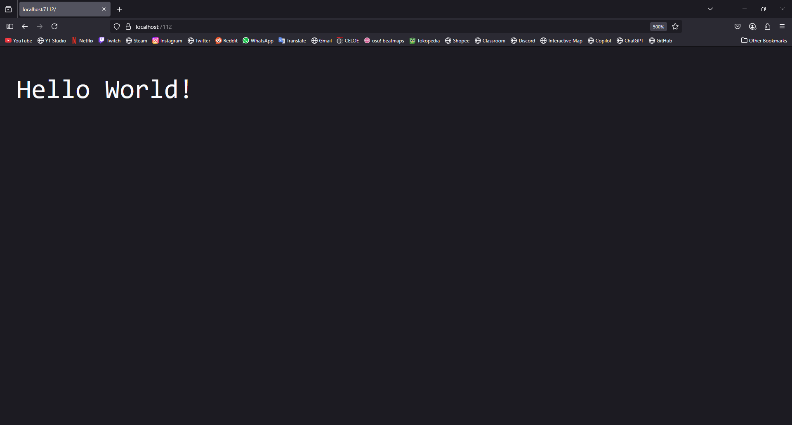
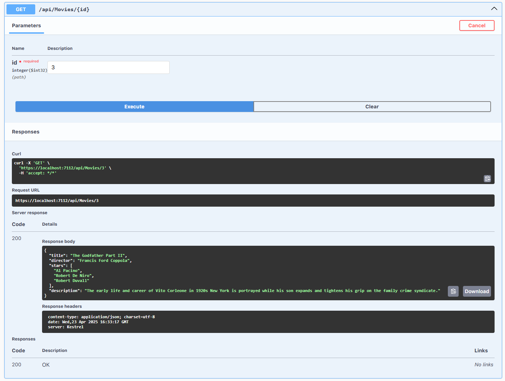

<div align="center">
JURNAL <br>
KONSTRUKSI PERANGKAT LUNAK <br>
<br>
MODUL IX <br>
<!-- JUDUL -->
 <br>


<br>

Disusun Oleh: <br>
Wahyu Isnantia Qodri Ghozali/2211104021 <br>
SE-06-01 <br>

<br>

Asisten Praktikum : <br>
Naufal El Kamil Aditya Pratama Rahman <br>
Imelda Alfina Palupi Dewi <br>

<br>

Dosen Pengampu : <br>
Yudha Islami Sulistya, S.Kom., M.Cs <br>

<br>

PROGRAM STUDI S1 REKAYASSA PERANGKAT LUNAK <br>
FAKULTAS INFORMATIKA <br> 
TELKOM UNIVERSITY PURWOKERTO <br>

</div>

## 1. Membuat Projek Baru




### Menambah NuGet Package:


## 2. Implementasi Kode


### Source Code
```
using Microsoft.OpenApi.Models;

namespace modul9_2211104021
{
    public class Movie
    {
        public string Title { get; set; }
        public string Director { get; set; }
        public List<string> Stars { get; set; }
        public string Description { get; set; }

        public Movie() { }
    }

    public static class MovieData
    {
        public static List<Movie> Movies = new List<Movie>
        {
            new Movie
            {
                Title = "The Shawshank Redemption",
                Director = "Frank Darabont",
                Stars = new List<string> { "Tim Robbins", "Morgan Freeman", "Bob Gunton" },
                Description = "Two imprisoned men bond over a number of years, finding solace and eventual redemption through acts of common decency."
            },
            new Movie
            {
                Title = "The Godfather",
                Director = "Francis Ford Coppola",
                Stars = new List<string> { "Marlon Brando", "Al Pacino", "James Caan" },
                Description = "An organized crime dynasty's aging patriarch transfers control of his clandestine empire to his reluctant son."
            },
            new Movie
            {
                Title = "The Dark Knight",
                Director = "Christopher Nolan",
                Stars = new List<string> { "Christian Bale", "Heath Ledger", "Aaron Eckhart" },
                Description = "When the menace known as the Joker wreaks havoc and chaos on the people of Gotham..."
            }
        };
    }

    public class Program
    {
        public static void Main(string[] args)
        {
            var builder = WebApplication.CreateBuilder(args);

            // Swagger
            builder.Services.AddEndpointsApiExplorer();
            builder.Services.AddSwaggerGen(c =>
            {
                c.SwaggerDoc("v1", new OpenApiInfo { Title = "Movies API", Version = "v1" });
            });

            var app = builder.Build();

            app.UseSwagger();
            app.UseSwaggerUI(c =>
            {
                c.SwaggerEndpoint("/swagger/v1/swagger.json", "Movies API V1");
            });

            // GET all movies
            app.MapGet("/api/Movies", () =>
            {
                return MovieData.Movies;
            });

            // GET movie by ID
            app.MapGet("/api/Movies/{id:int}", (int id) =>
            {
                if (id < 0 || id >= MovieData.Movies.Count)
                    return Results.NotFound("Movie not found");
                return Results.Ok(MovieData.Movies[id]);
            });

            // POST add movie
            app.MapPost("/api/Movies", (Movie newMovie) =>
            {
                MovieData.Movies.Add(newMovie);
                return Results.Created($"/api/Movies/{MovieData.Movies.Count - 1}", newMovie);
            });

            // DELETE movie
            app.MapDelete("/api/Movies/{id:int}", (int id) =>
            {
                if (id < 0 || id >= MovieData.Movies.Count)
                    return Results.NotFound("Movie not found");
                var removed = MovieData.Movies[id];
                MovieData.Movies.RemoveAt(id);
                return Results.Ok(removed);
            });

            app.Run();
        }
    }
}

```
### Penjelasan
Di file `Program.cs` akan dibuat API sederhana pakai ASPNET Core yang nyimpen data film dalam list static tanpa database. Program ini nyediain endpoint buat liat semua film, ambil film berdasarkan index, nambah film baru, dan hapus film, semuanya bisa diakses lewat Swagger di `/swagger`. Data awalnya udah ada 3 film top IMDb, dan semua request ditangani langsung pake lambda biar simpel dan respons cepat.


## 3. Output

## GET


## POST


## GET by id


## DELETE by id

