<div align="center">
JURNAL <br>
KONSTRUKSI PERANGKAT LUNAK <br>
<br>
MODUL X <br>
<!-- JUDUL -->
 <br>


<br>

Disusun Oleh: <br>
Wahyu Isnantia Qodri Ghozali/2211104021 <br>
SE-06-01 <br>

<br>

Asisten Praktikum : <br>
Naufal El Kamil Aditya Pratama Rahman <br>
Imelda Alfina Palupi Dewi <br>

<br>

Dosen Pengampu : <br>
Yudha Islami Sulistya, S.Kom., M.Cs <br>

<br>

PROGRAM STUDI S1 REKAYASSA PERANGKAT LUNAK <br>
FAKULTAS INFORMATIKA <br> 
TELKOM UNIVERSITY PURWOKERTO <br>

</div>

## 1. Membuat Project Baru
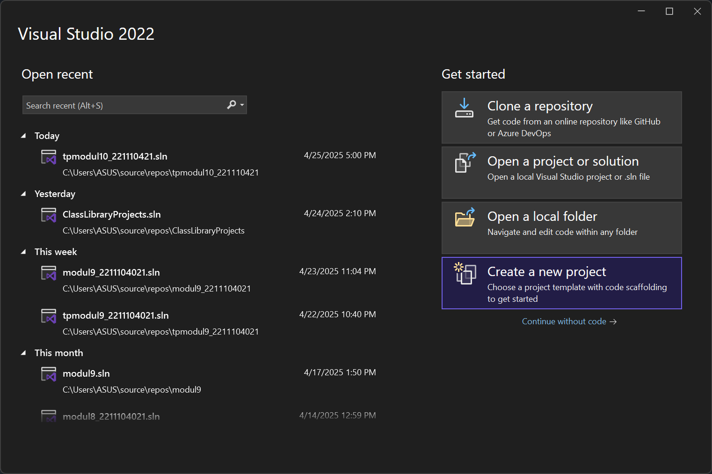
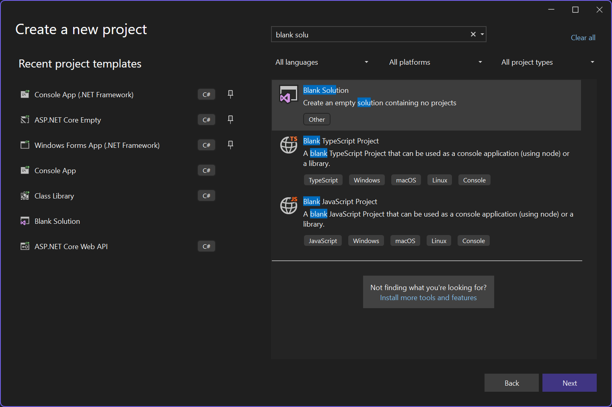
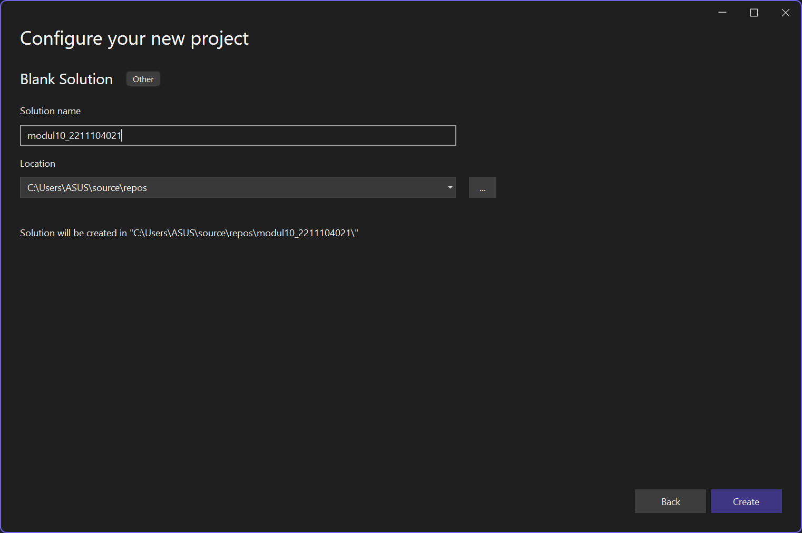

### Membuat Class Library, `Klik kanan pada solution modul10_2211104021 > Add > New Project > Pilih Class Library > Create`
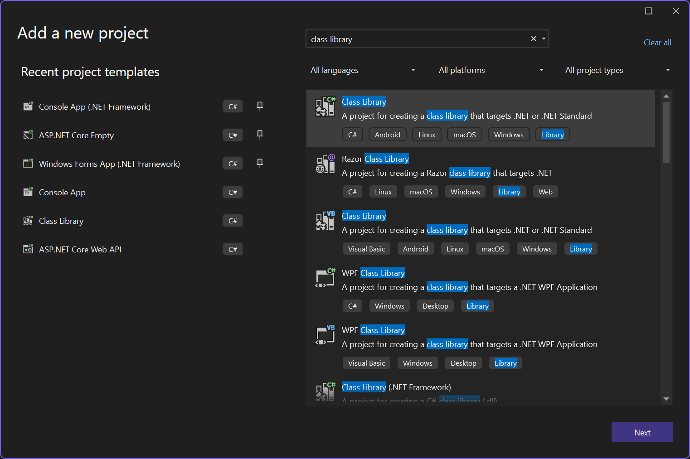
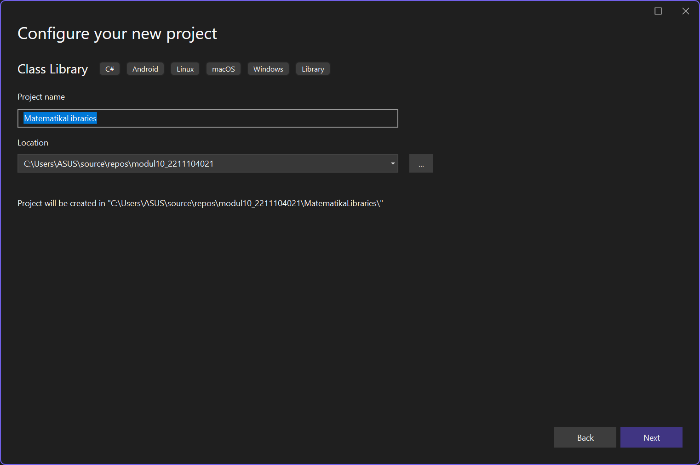
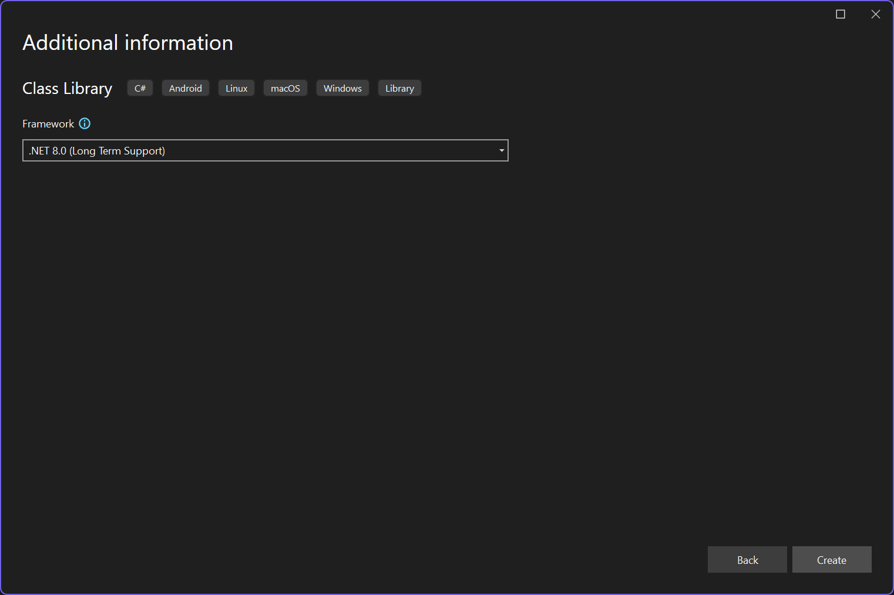

### Membuat Console App, `Klik kanan pada solution modul10_2211104021 > Add > New Project > Pilih Console App > Create`
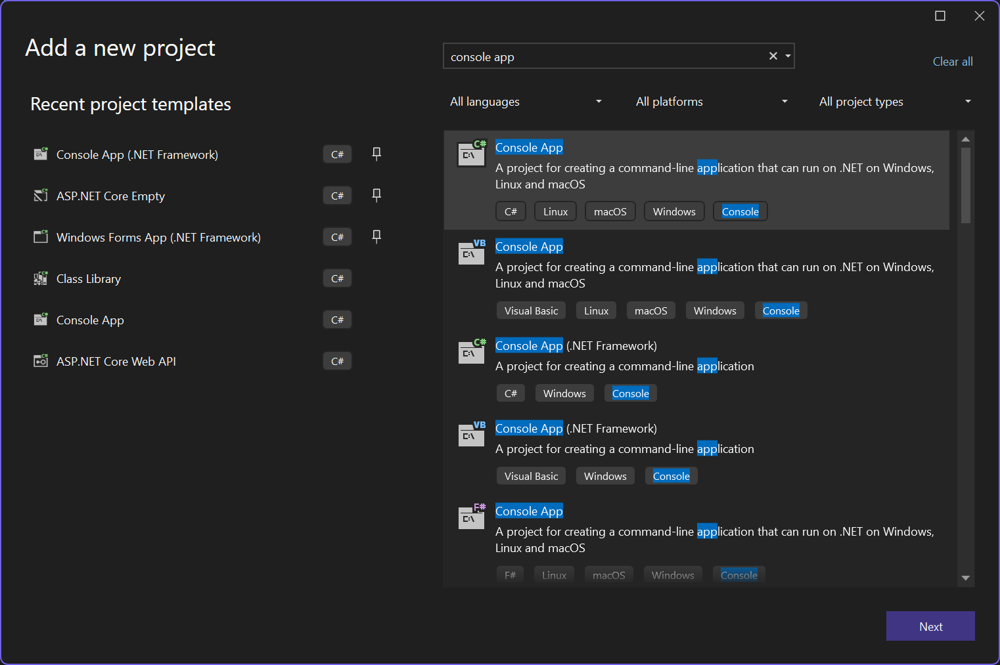
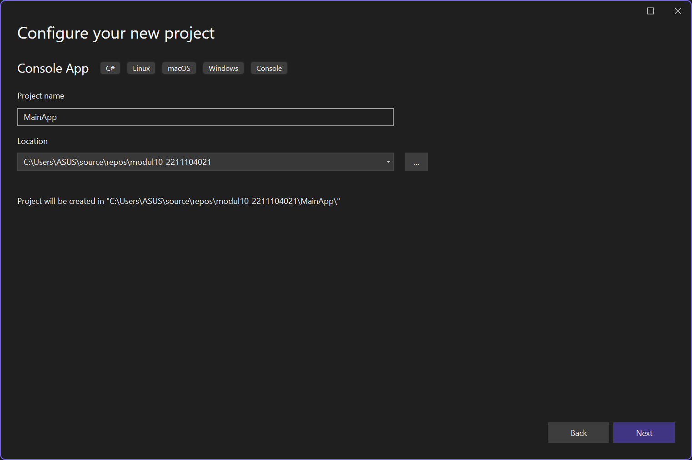
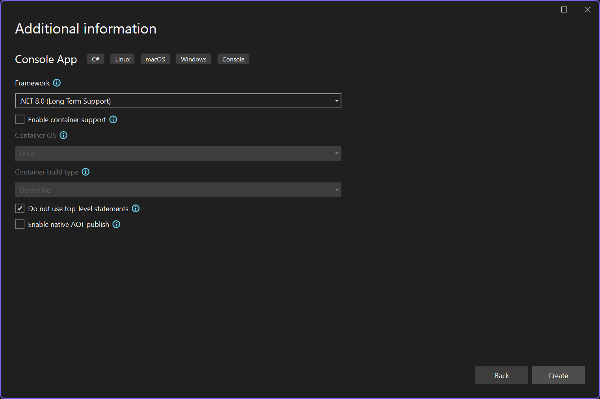

## 2. Implementasi Kode
### Source Code Library `Class1.cs`:
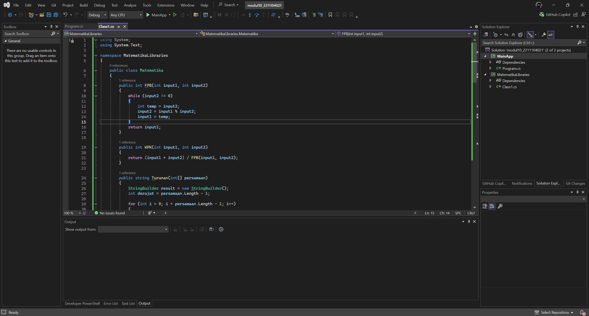

```
using System;
using System.Text;

namespace MatematikaLibraries
{
    public class Matematika
    {
        public int FPB(int input1, int input2)
        {
            while (input2 != 0)
            {
                int temp = input2;
                input2 = input1 % input2;
                input1 = temp;
            }
            return input1;
        }

        public int KPK(int input1, int input2)
        {
            return (input1 * input2) / FPB(input1, input2);
        }

        public string Turunan(int[] persamaan)
        {
            StringBuilder result = new StringBuilder();
            int derajat = persamaan.Length - 1;

            for (int i = 0; i < persamaan.Length - 1; i++)
            {
                int koef = persamaan[i];
                int pangkat = derajat - i;
                int hasil = koef * pangkat;

                if (hasil == 0) continue;

                if (result.Length > 0 && hasil > 0)
                    result.Append(" + ");
                else if (hasil < 0)
                    result.Append(" - ");

                int absHasil = Math.Abs(hasil);
                result.Append(absHasil);
                if (pangkat - 1 > 1)
                    result.Append($"x{pangkat - 1}");
                else if (pangkat - 1 == 1)
                    result.Append("x");
            }

            return result.ToString();
        }

        public string Integral(int[] persamaan)
        {
            StringBuilder result = new StringBuilder();
            int derajat = persamaan.Length - 1;

            for (int i = 0; i < persamaan.Length; i++)
            {
                int koef = persamaan[i];
                int pangkatBaru = derajat - i + 1;

                if (result.Length > 0 && koef > 0)
                    result.Append(" + ");
                else if (koef < 0)
                    result.Append(" - ");

                int absKoef = Math.Abs(koef);
                if (absKoef != 1 || pangkatBaru == 0)
                    result.Append($"{absKoef}");

                if (pangkatBaru > 0)
                {
                    result.Append("x");
                    if (pangkatBaru > 1)
                        result.Append($"{pangkatBaru}");
                }
            }

            result.Append(" + C");
            return result.ToString();
        }
    }
}

```

### Menambahkan Referensi ke Library
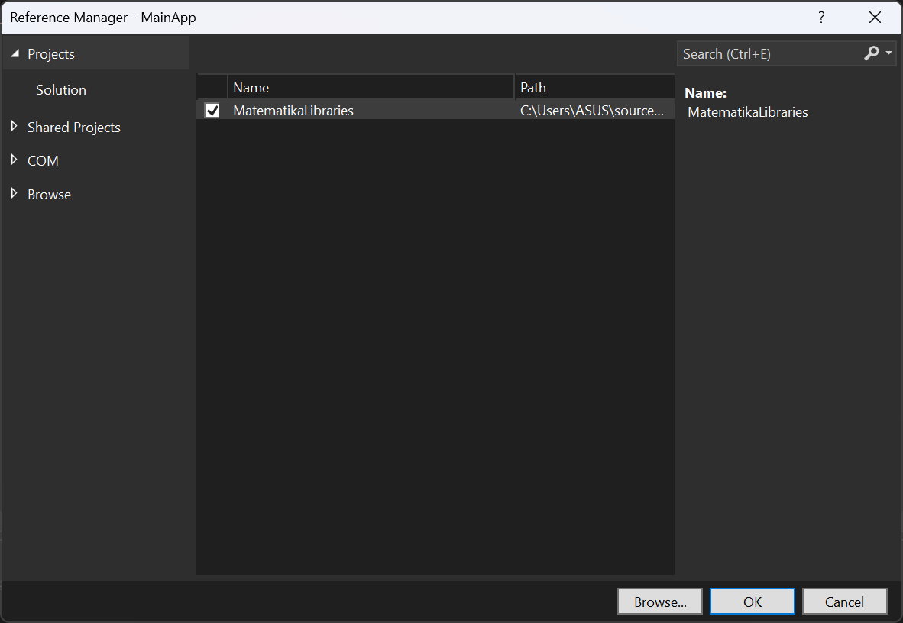


### Source Code Library `Program.cs`:
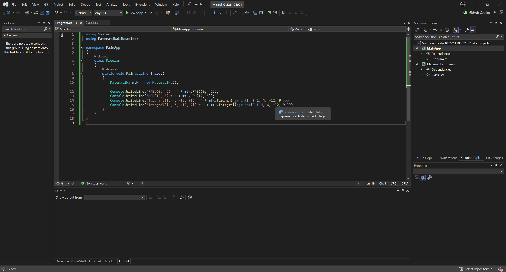

```
using System;
using MatematikaLibraries;

namespace MainApp
{
    class Program
    {
        static void Main(string[] args)
        {
            Matematika mtk = new Matematika();

            Console.WriteLine("FPB(60, 45) = " + mtk.FPB(60, 45));
            Console.WriteLine("KPK(12, 8) = " + mtk.KPK(12, 8));
            Console.WriteLine("Turunan({1, 4, -12, 9}) = " + mtk.Turunan(new int[] { 1, 4, -12, 9 }));
            Console.WriteLine("Integral({4, 6, -12, 9}) = " + mtk.Integral(new int[] { 4, 6, -12, 9 }));
        }
    }
}

```

### Penjelasan:
Di program tersebut akan dibuat dua project dalam satu solution, yaitu `MatematikaLibraries` sebagai class library yang berisi fungsi-fungsi matematika seperti FPB, KPK, turunan, dan integral, serta `MainApp` sebagai console application yang memanggil dan menampilkan hasil dari fungsi-fungsi tersebut. Di dalam library, fungsi FPB menggunakan algoritma Euclidean untuk mencari pembagi terbesar dua angka, KPK menggunakan hasil perkalian dibagi FPB, sedangkan turunan dan integral bekerja dengan mengolah array koefisien persamaan polinomial sesuai aturan kalkulus, lalu mengubahnya menjadi format string yang bisa ditampilkan. Di `MainApp`, fungsi-fungsi tersebut dipanggil dan hasilnya ditampilkan ke layar.

## 3. Output
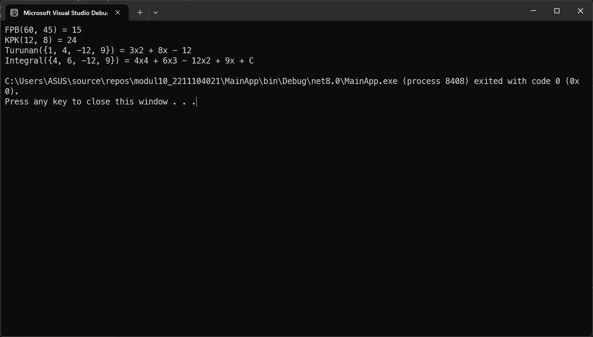

