<div align="center">
TUGAS PENDAHULUAN <br>
KONSTRUKSI PERANGKAT LUNAK <br>
<br>
MODUL X <br>
<!-- JUDUL -->
 <br>


<br>

Disusun Oleh: <br>
Wahyu Isnantia Qodri Ghozali/2211104021 <br>
SE-06-01 <br>

<br>

Asisten Praktikum : <br>
Naufal El Kamil Aditya Pratama Rahman <br>
Imelda Alfina Palupi Dewi <br>

<br>

Dosen Pengampu : <br>
Yudha Islami Sulistya, S.Kom., M.Cs <br>

<br>

PROGRAM STUDI S1 REKAYASSA PERANGKAT LUNAK <br>
FAKULTAS INFORMATIKA <br> 
TELKOM UNIVERSITY PURWOKERTO <br>

</div>

## 1. Membuat Projek Baru
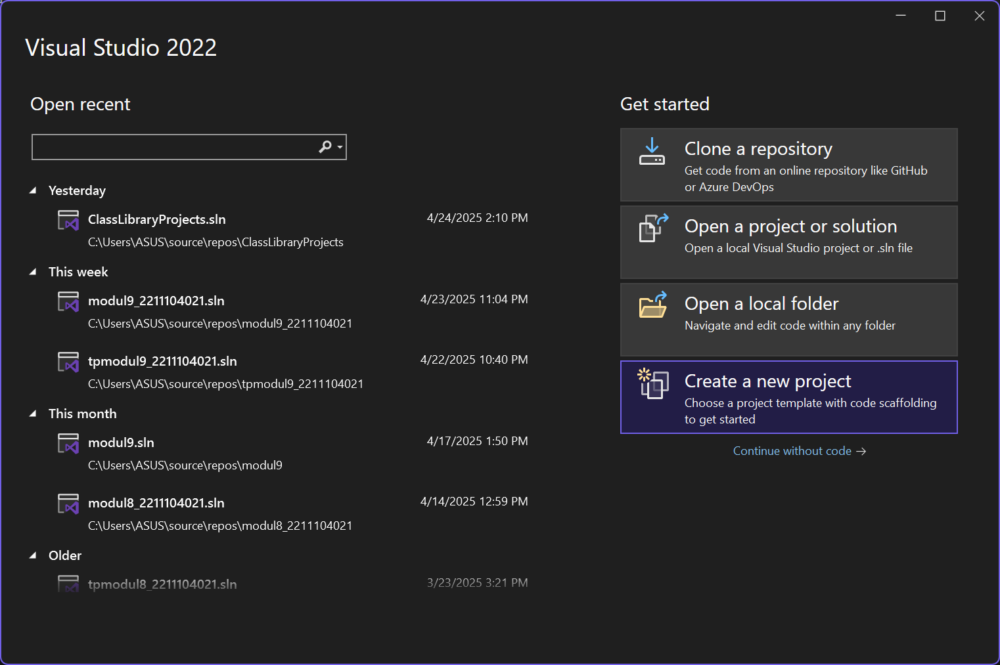
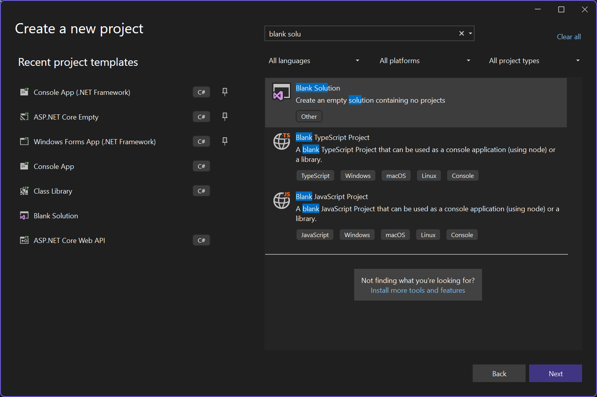
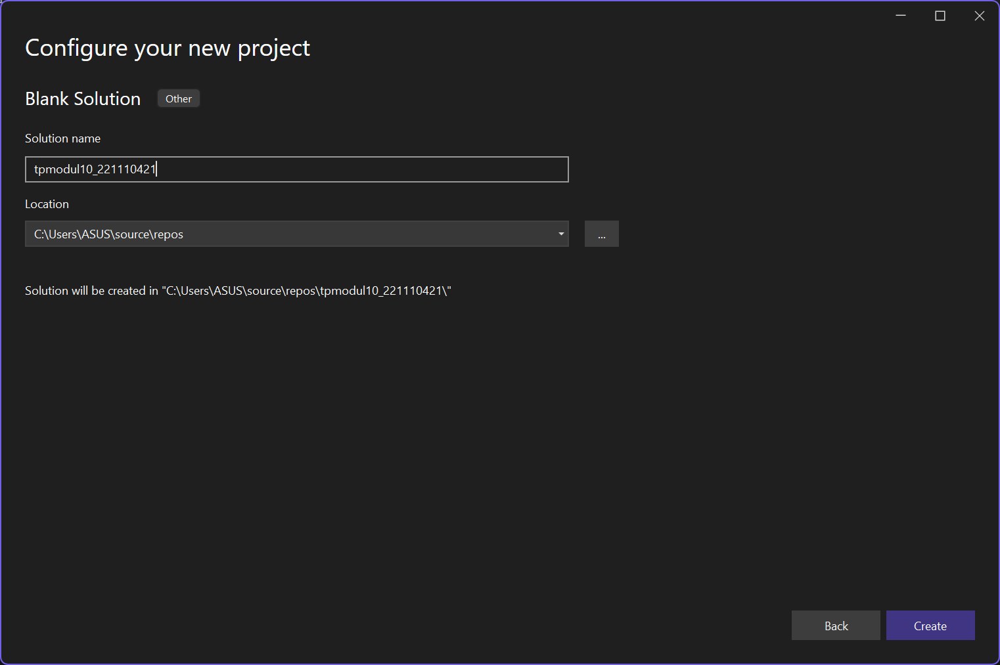

### Membuat Class Library, `Klik kanan pada solution tpmodul10_2211104021 > Add > New Project > Pilih Class Library > Create`
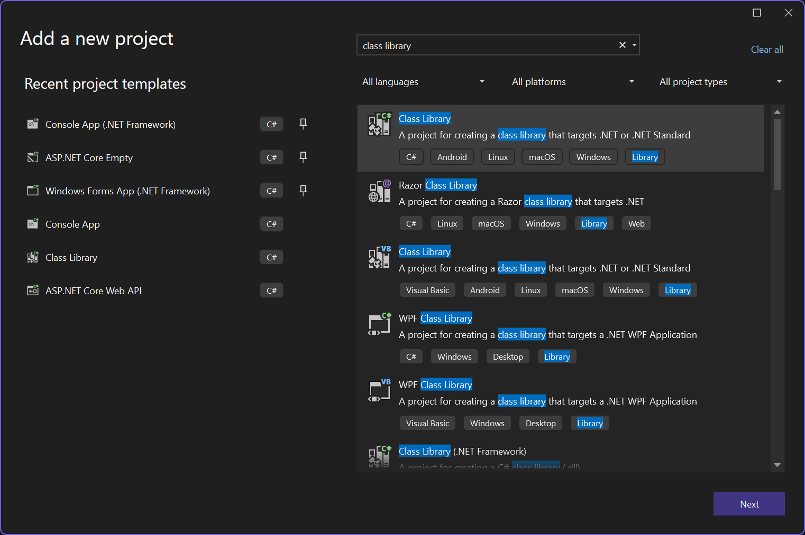
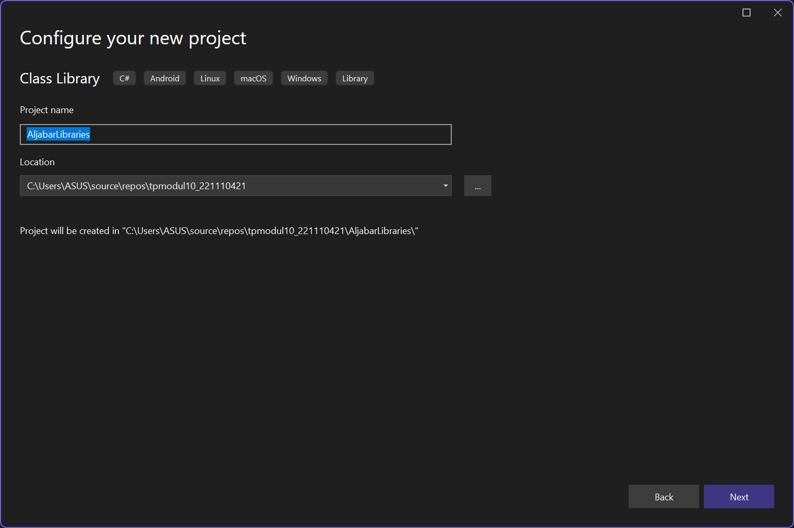
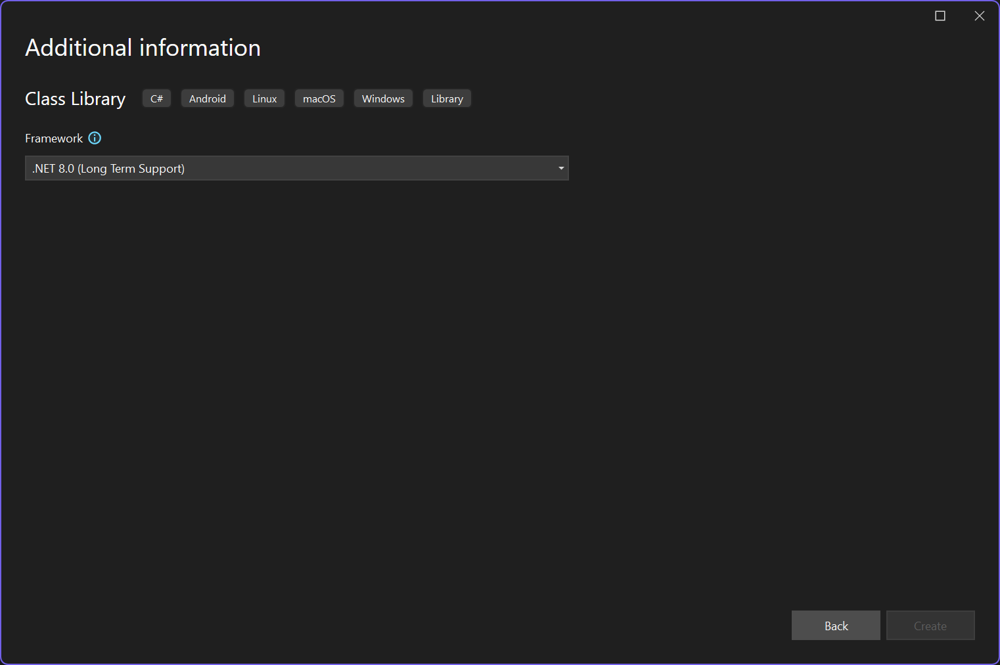

### Membuat Console App, `Klik kanan pada solution tpmodul10_2211104021 > Add > New Project > Pilih Console App > Create`
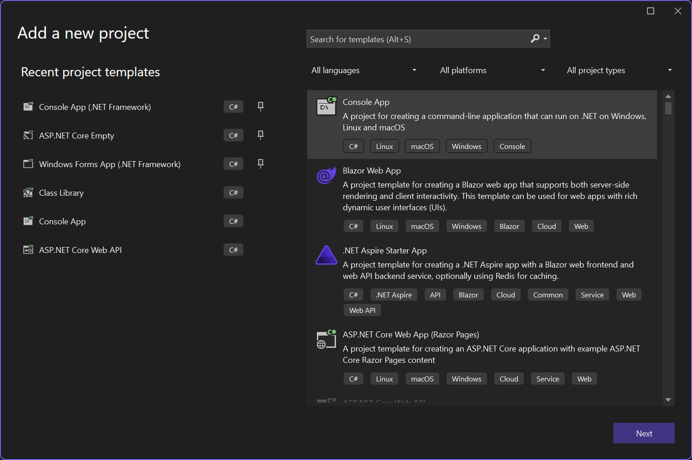
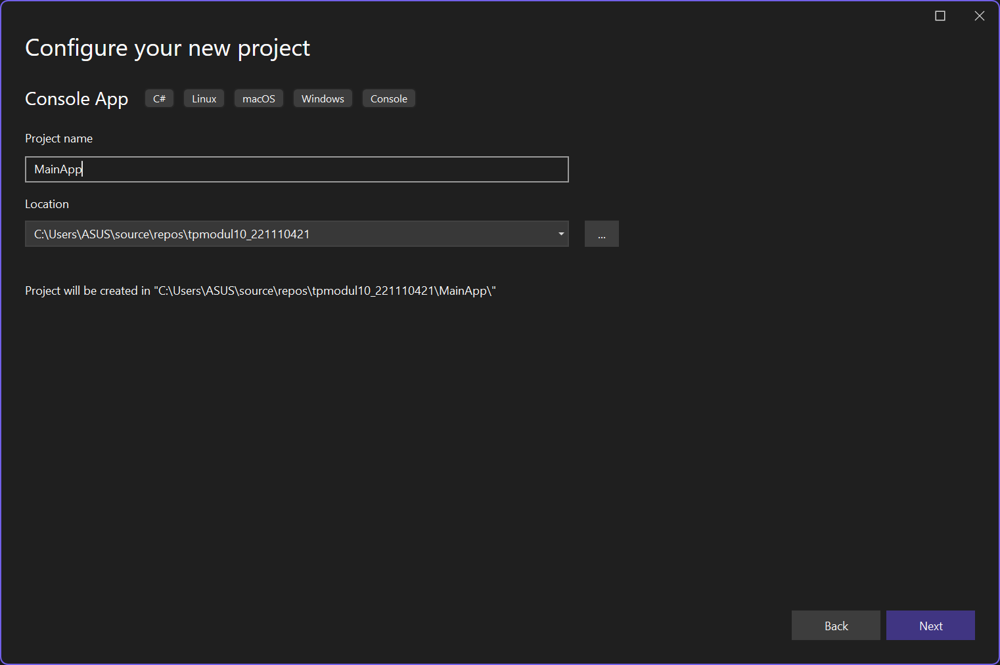
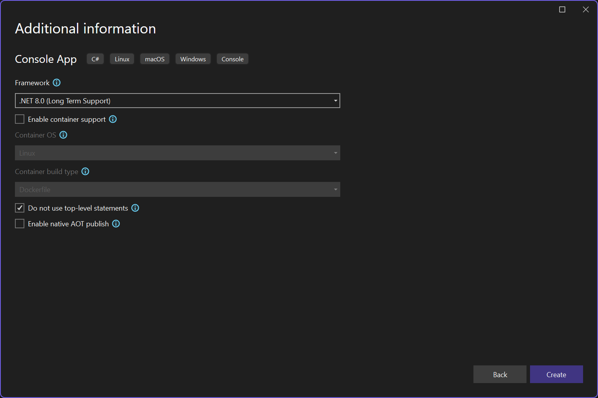


## 2. Implementasi Kode
### Source Code Library `Class1.cs`:
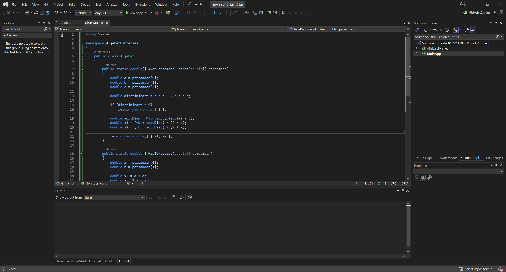

```
using System;

namespace AljabarLibraries
{
    public class Aljabar
    {
        public static double[] AkarPersamaanKuadrat(double[] persamaan)
        {
            double a = persamaan[0];
            double b = persamaan[1];
            double c = persamaan[2];

            double discriminant = b * b - 4 * a * c;

            if (discriminant < 0)
                return new double[] { };

            double sqrtDisc = Math.Sqrt(discriminant);
            double x1 = (-b + sqrtDisc) / (2 * a);
            double x2 = (-b - sqrtDisc) / (2 * a);

            return new double[] { x1, x2 };
        }

        public static double[] HasilKuadrat(double[] persamaan)
        {
            double a = persamaan[0];
            double b = persamaan[1];

            double x2 = a * a;
            double x = 2 * a * b;
            double konstanta = b * b;

            return new double[] { x2, x * -1, konstanta };
        }
    }
}
```
### Menambahkan Referensi ke Library
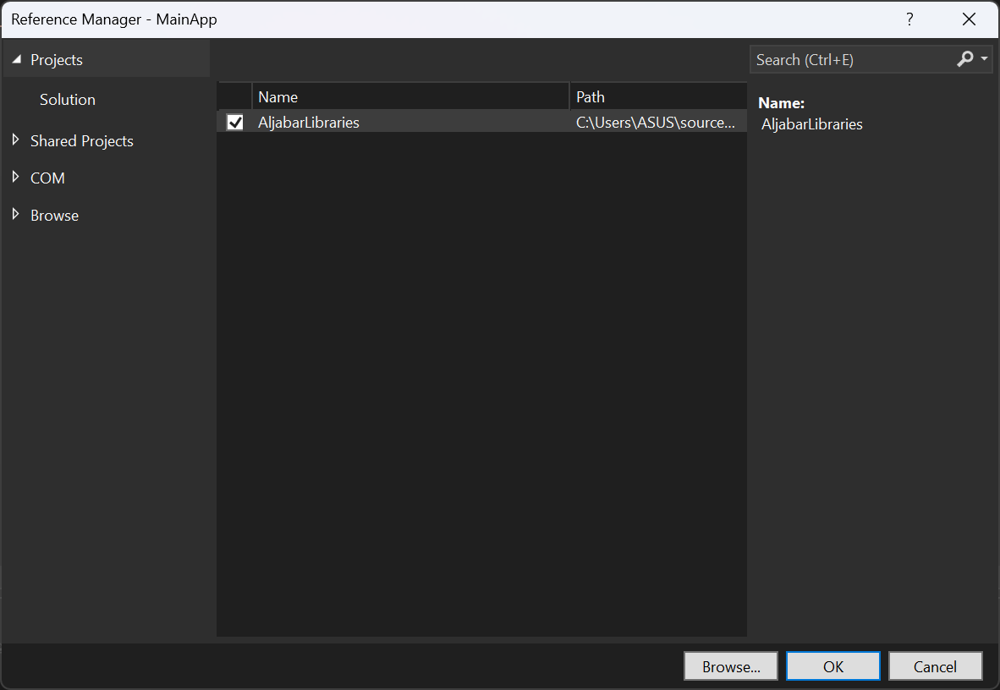


### Source Code Library `Program.cs`:
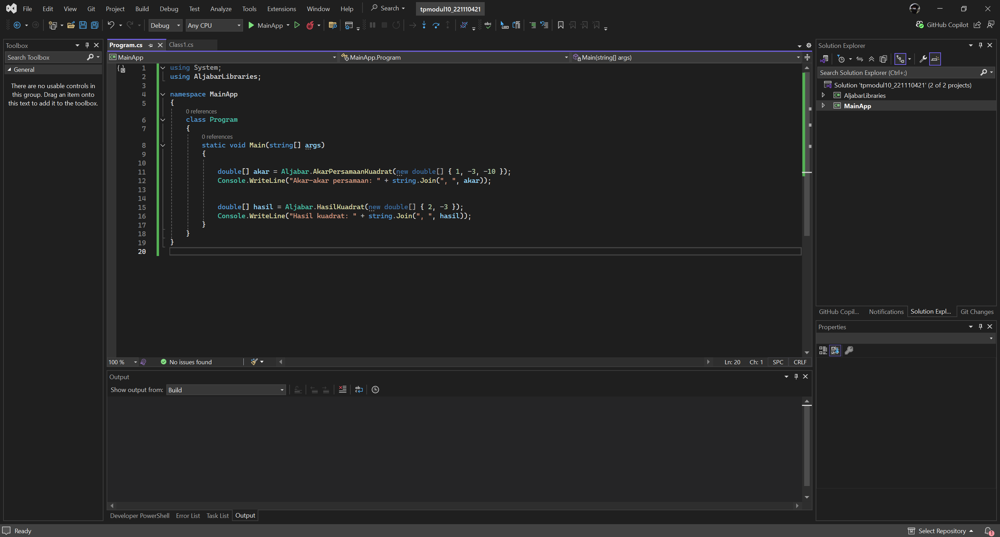

```
using System;
using AljabarLibraries;

namespace MainApp
{
    class Program
    {
        static void Main(string[] args)
        {
            
            double[] akar = Aljabar.AkarPersamaanKuadrat(new double[] { 1, -3, -10 });
            Console.WriteLine("Akar-akar persamaan: " + string.Join(", ", akar));

            
            double[] hasil = Aljabar.HasilKuadrat(new double[] { 2, -3 });
            Console.WriteLine("Hasil kuadrat: " + string.Join(", ", hasil));
        }
    }
}

```

### Klik kanan `MainApp > Set as Startup Project`, lalu jalankan

### Penjelasan:
Di file `Aljabar.cs` akan dibuat dua fungsi dalam namespace `AljabarLibraries` yang masing-masing menghitung akar-akar persamaan kuadrat dan hasil kuadrat dari bentuk linier. Fungsi `AkarPersamaanKuadrat` akan menerima array berisi koefisien a, b, dan c dari persamaan kuadrat, lalu menghitung diskriminan untuk menentukan dua akar real menggunakan rumus kuadrat. Sedangkan fungsi `HasilKuadrat` akan menerima dua koefisien dari persamaan linier (a dan b), lalu mengembalikan hasil dari kuadrat bentuk `(ax + b)²` menjadi tiga koefisien hasil dari ekspansi `a²x² + 2abx + b²`. Kedua fungsi tersebut akan digunakan oleh program utama di `Program.cs`, di mana input dikirim dalam bentuk array dan hasilnya ditampilkan ke console.

## 3. Output
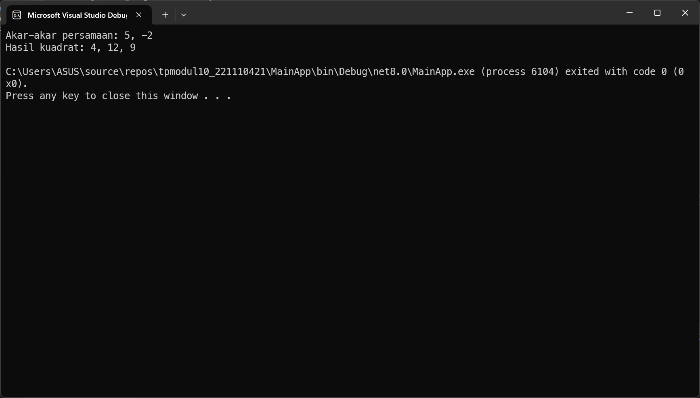
