<div align="center">
JURNAL <br>
KONSTRUKSI PERANGKAT LUNAK <br>
<br>
MODUL XII <br>
<!-- JUDUL -->
 <br>


<br>

Disusun Oleh: <br>
Wahyu Isnantia Qodri Ghozali/2211104021 <br>
SE-06-01 <br>

<br>

Asisten Praktikum : <br>
Naufal El Kamil Aditya Pratama Rahman <br>
Imelda Alfina Palupi Dewi <br>

<br>

Dosen Pengampu : <br>
Yudha Islami Sulistya, S.Kom., M.Cs <br>

<br>

PROGRAM STUDI S1 REKAYASSA PERANGKAT LUNAK <br>
FAKULTAS INFORMATIKA <br> 
TELKOM UNIVERSITY PURWOKERTO <br>

</div>

## 1. Membuat Projek Baru
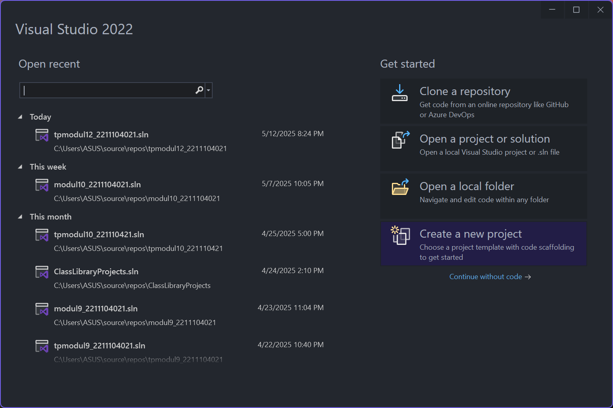
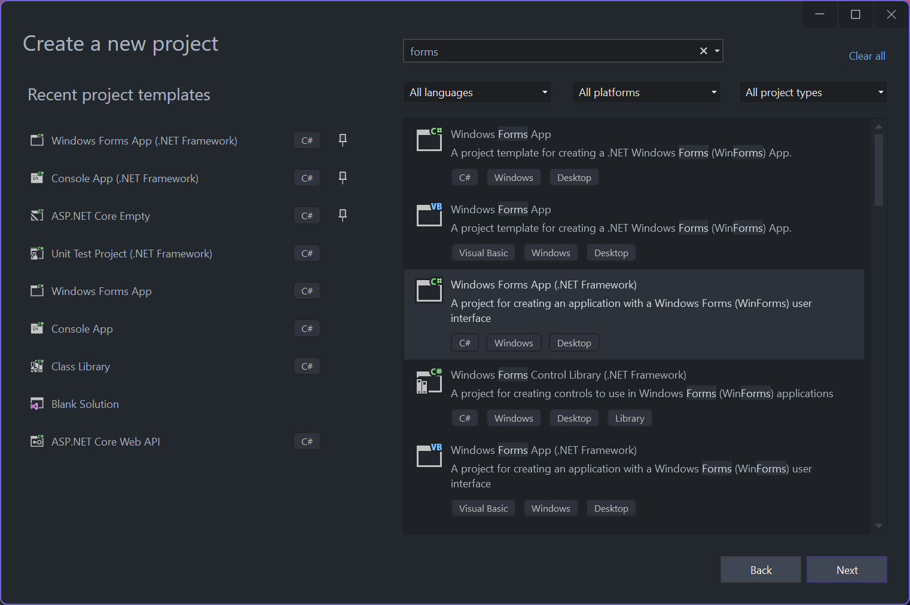
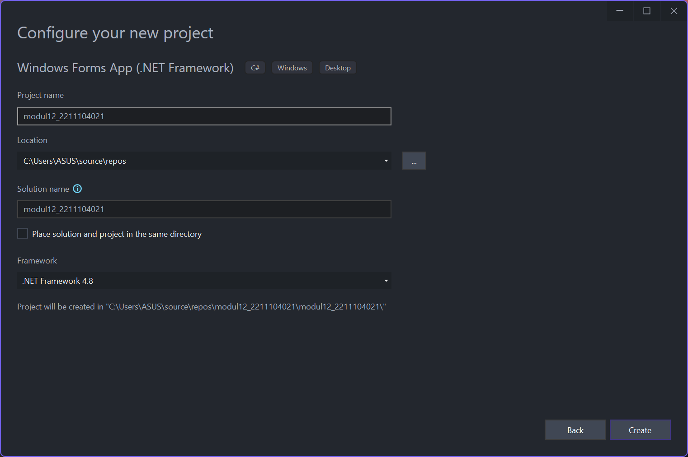

### Desain GUI:
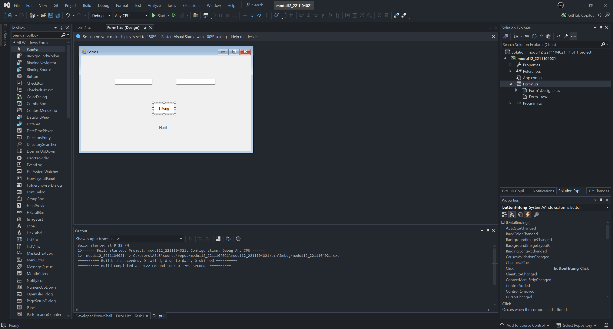

## Source Code `Form1.cs`:
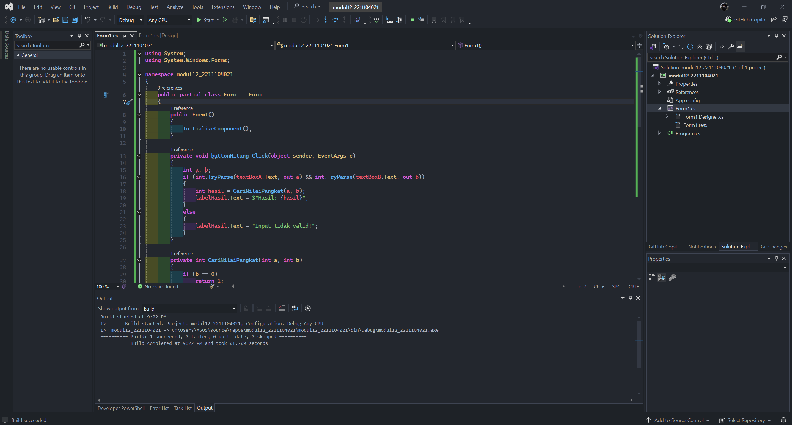

```
using System;
using System.Windows.Forms;

namespace modul12_2211104021
{
    public partial class Form1 : Form
    {
        public Form1()
        {
            InitializeComponent();
        }

        private void buttonHitung_Click(object sender, EventArgs e)
        {
            int a, b;
            if (int.TryParse(textBoxA.Text, out a) && int.TryParse(textBoxB.Text, out b))
            {
                int hasil = CariNilaiPangkat(a, b);
                labelHasil.Text = $"Hasil: {hasil}";
            }
            else
            {
                labelHasil.Text = "Input tidak valid!";
            }
        }

        private int CariNilaiPangkat(int a, int b)
        {
            if (b == 0)
                return 1;

            if (b < 0)
                return -1;

            if (b > 10 || a > 100)
                return -2;

            int hasil = 1;
            try
            {
                checked
                {
                    for (int i = 0; i < b; i++)
                    {
                        hasil *= a;
                    }
                }
            }
            catch (OverflowException)
            {
                return -3;
            }

            return hasil;
        }
    }
}
```

### Output:
#### Rule I
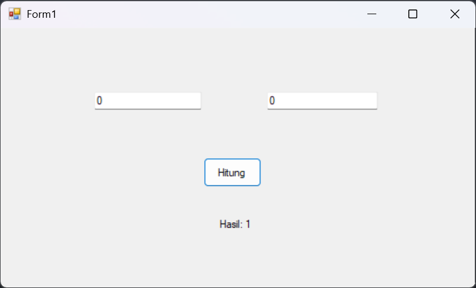

#### Rule II


#### Rule III
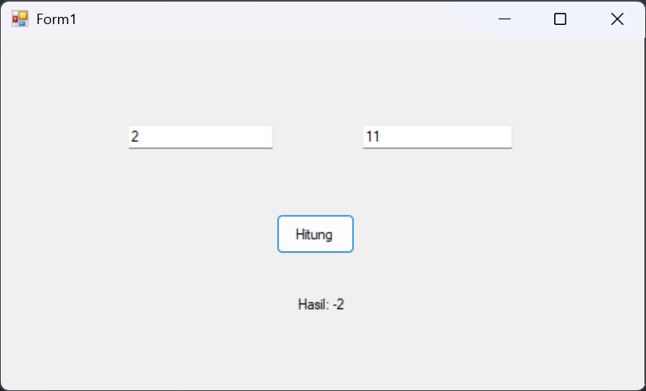
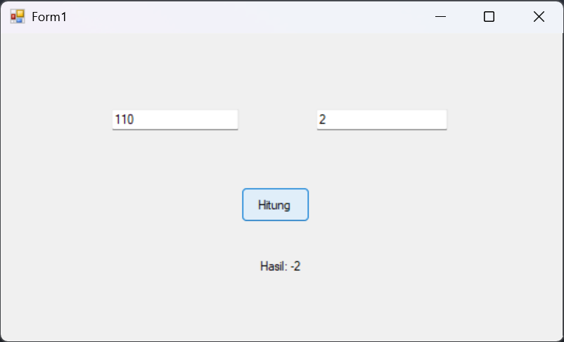

#### Rule IV


### Penjelasan:
Di file `Form1.cs` akan dibuat sebuah antarmuka grafis di mana pengguna dapat memasukkan dua angka ke dalam dua `TextBox`, lalu ketika tombol ditekan, event `buttonHitung_Click` akan dijalankan untuk membaca input dari kedua textbox tersebut dan mengonversinya menjadi integer. Jika input valid, maka program akan memanggil method `CariNilaiPangkat` dengan kedua angka tersebut sebagai parameter. Di dalam method ini akan dilakukan pengecekan sesuai aturan khusus yaitu: jika nilai pangkat (`b`) nol maka hasilnya 1, jika `b` negatif maka hasilnya -1, jika `b` lebih dari 10 atau `a` lebih dari 100 maka hasilnya -2, dan jika hasil pangkat melebihi batas integer dengan pengecekan menggunakan `checked`, maka hasilnya -3. Jika semua kondisi lolos, maka akan dilakukan iterasi untuk menghitung hasil pangkat dan hasilnya dikembalikan serta ditampilkan di label output di form GUI.

## 3. Software Profiling

### Pada saat idle
<ul>
<li>CPU <br>
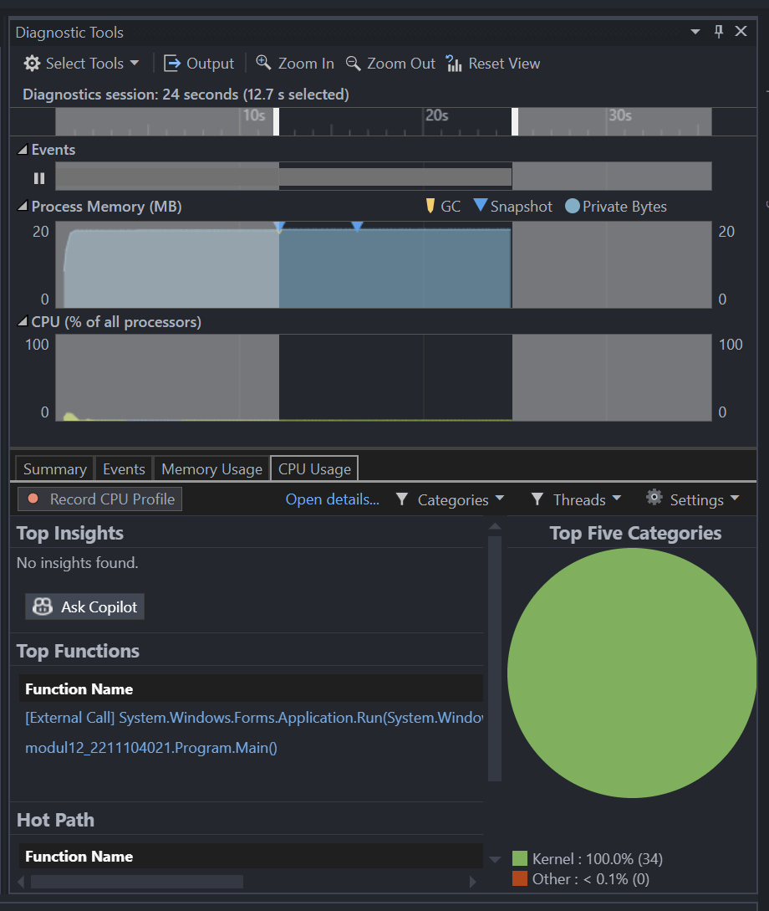
<li>Memory <br>
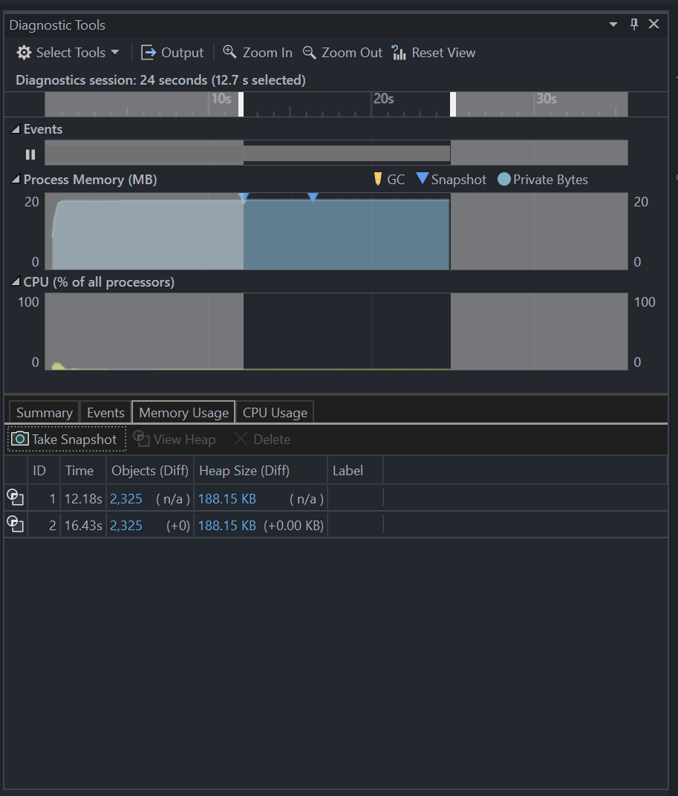
</ul>

### Pada input 3 & 19
<ul>
<li>CPU <br>
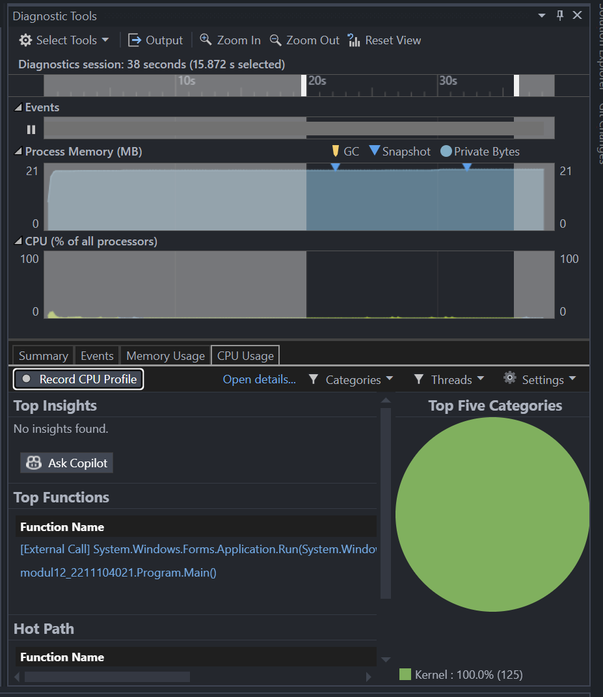
<li>Memory <br>
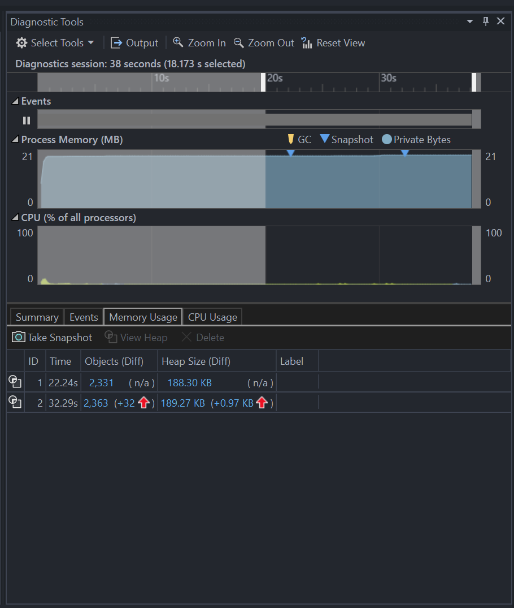
</ul>

### Pada input 9 & 30
<ul>
<li>CPU <br>
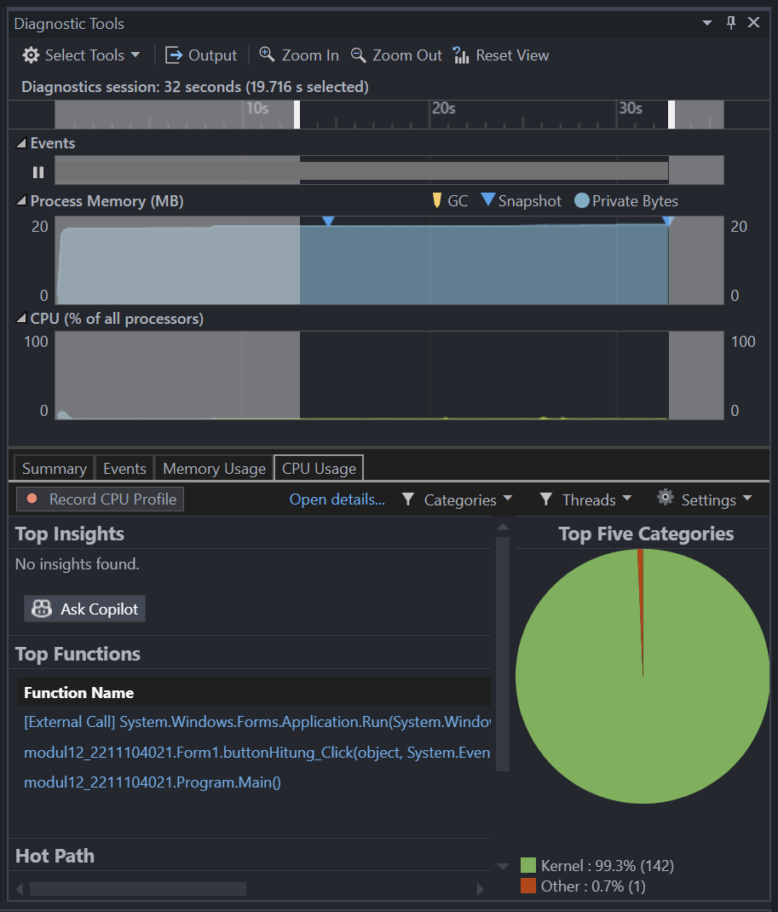
<li>Memory <br>
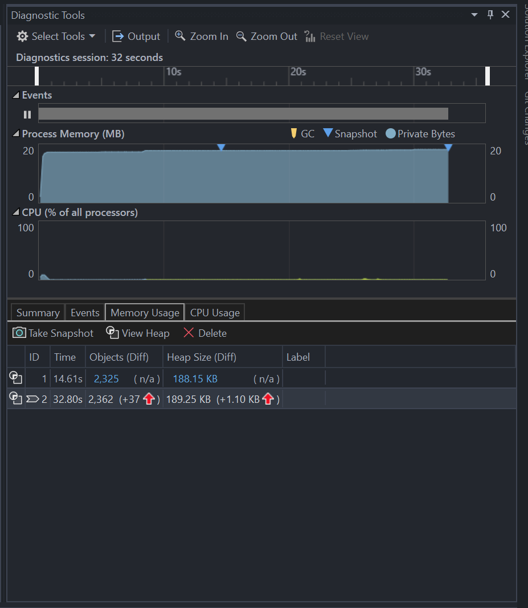
</ul>

### Hasil
Pada saat idle dan input pertama, terjadi peningkatan memory begitu pula pada input kedua dengan kenaikan memory yang sedikit lebih besar

## 4. Unit Testing
### Source Code `UnitTest1.cs`:
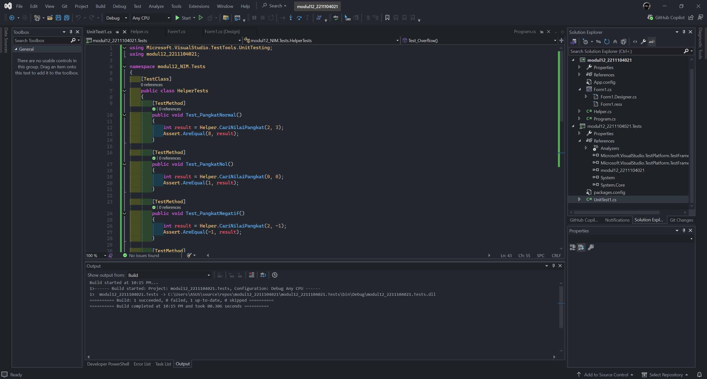

### Hasil Testing:
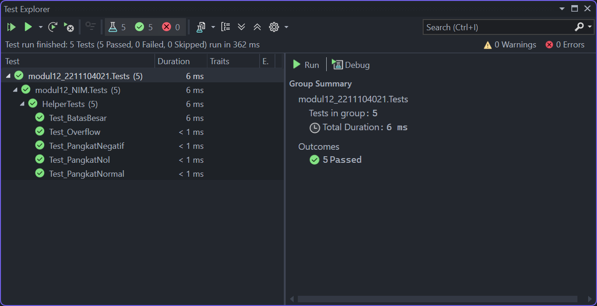