<div align="center">
TUGAS PENDAHULUAN <br>
KONSTRUKSI PERANGKAT LUNAK <br>
<br>
MODUL XII <br>
<!-- JUDUL -->
 <br>


<br>

Disusun Oleh: <br>
Wahyu Isnantia Qodri Ghozali/2211104021 <br>
SE-06-01 <br>

<br>

Asisten Praktikum : <br>
Naufal El Kamil Aditya Pratama Rahman <br>
Imelda Alfina Palupi Dewi <br>

<br>

Dosen Pengampu : <br>
Yudha Islami Sulistya, S.Kom., M.Cs <br>

<br>

PROGRAM STUDI S1 REKAYASSA PERANGKAT LUNAK <br>
FAKULTAS INFORMATIKA <br> 
TELKOM UNIVERSITY PURWOKERTO <br>

</div>

## 1. Membuat Projek Baru

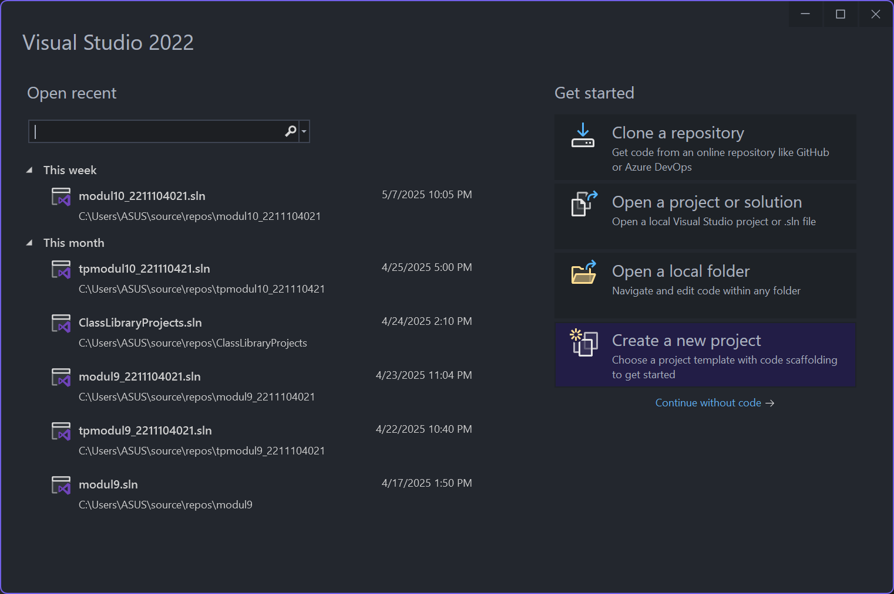
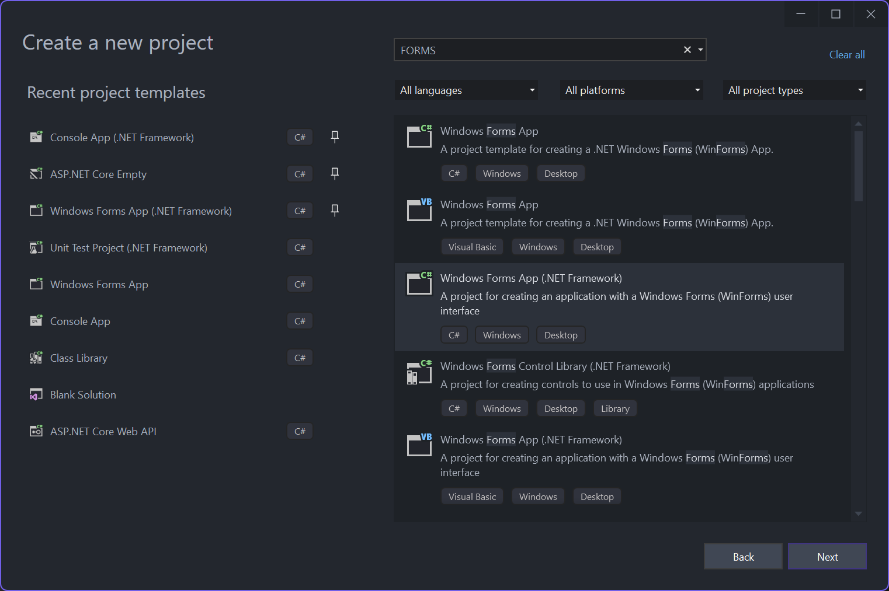
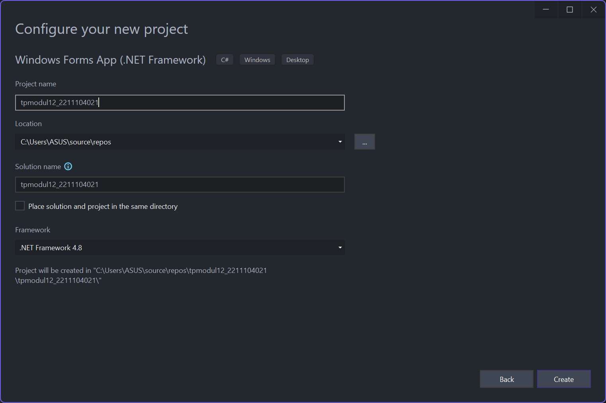
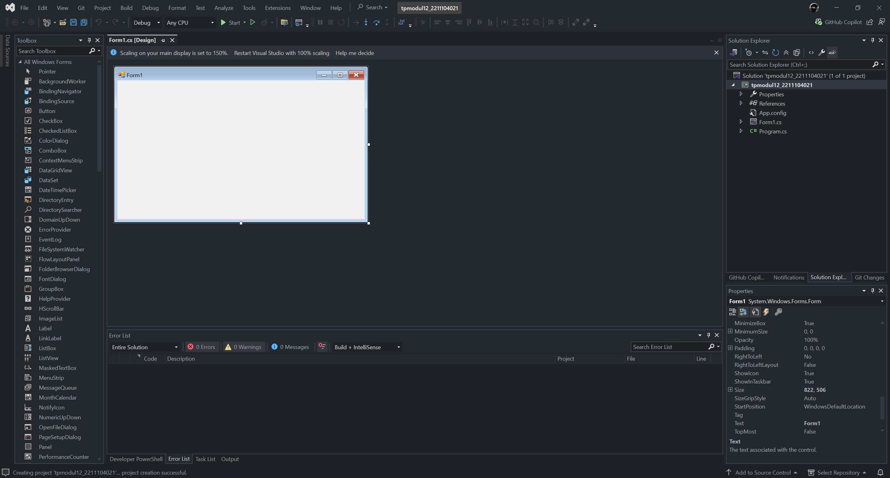

## 2. Implementasi Kode
### Desain GUI
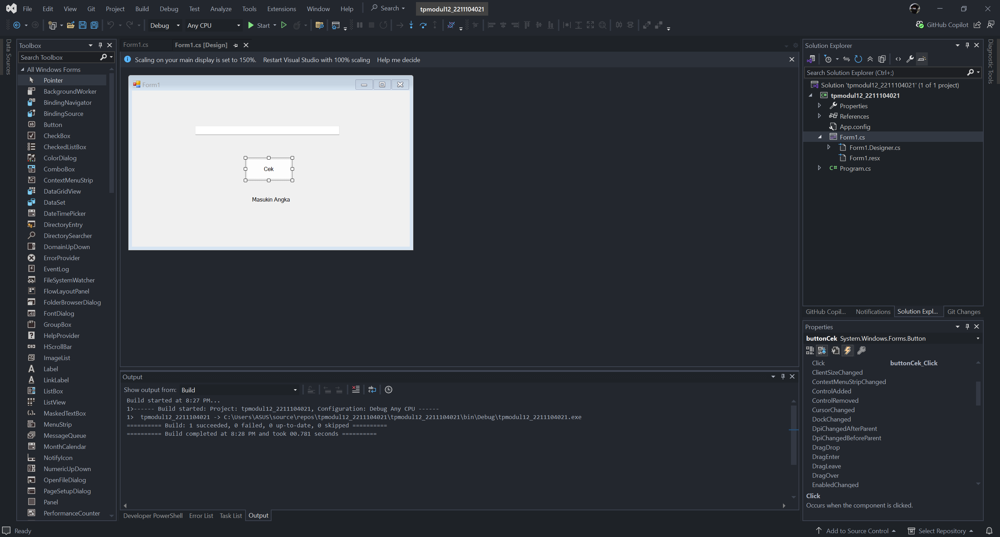

### Source Code `Form1.cs`:
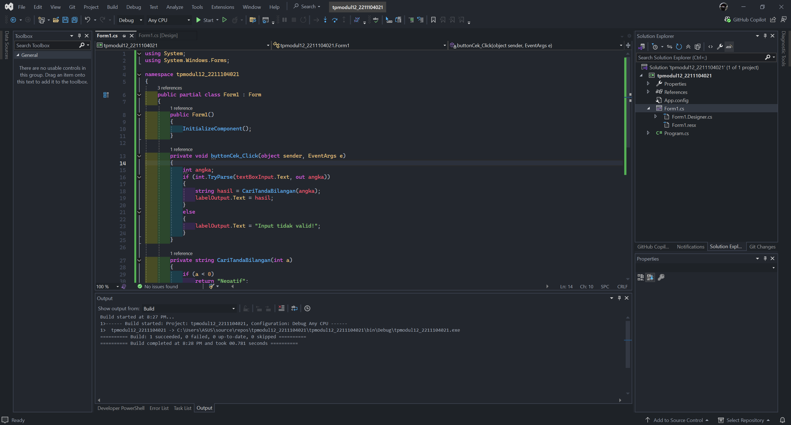


```
using System;
using System.Windows.Forms;

namespace tpmodul12_2211104021
{
    public partial class Form1 : Form
    {
        public Form1()
        {
            InitializeComponent();
        }

        private void buttonCek_Click(object sender, EventArgs e)
        {
            int angka;
            if (int.TryParse(textBoxInput.Text, out angka))
            {
                string hasil = CariTandaBilangan(angka);
                labelOutput.Text = hasil;
            }
            else
            {
                labelOutput.Text = "Input tidak valid!";
            }
        }

        private string CariTandaBilangan(int a)
        {
            if (a < 0)
                return "Negatif";
            else if (a > 0)
                return "Positif";
            else
                return "Nol";
        }
    }
}
```

### Output
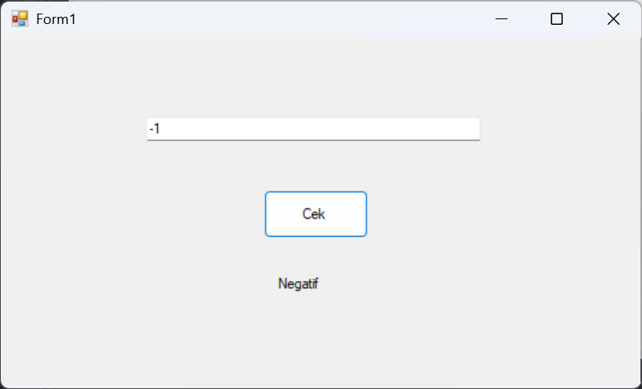
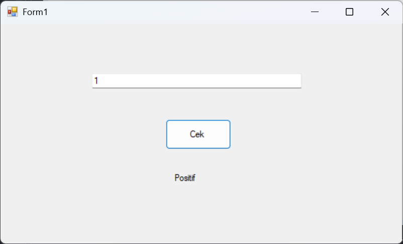
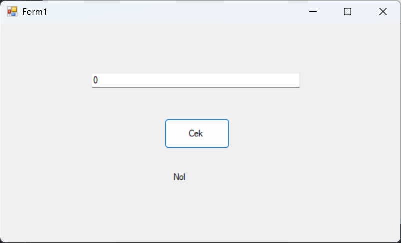

### Penjelasan
Di file `Form1.cs` akan dilakukan proses pengecekan input angka dari pengguna melalui sebuah `TextBox` saat tombol ditekan. Ketika tombol ditekan, event handler `buttonCek_Click` akan dijalankan yang akan membaca teks dari `textBoxInput`, lalu mencoba mengubahnya menjadi tipe data `int`. Jika konversi berhasil, maka method `CariTandaBilangan` akan dipanggil dengan angka tersebut sebagai parameter, dan method ini akan mengembalikan string “Negatif”, “Positif”, atau “Nol” sesuai nilai angka yang dimasukkan. Nilai hasil dari method tersebut kemudian akan ditampilkan di `labelOutput` sebagai output bagi pengguna. Jika input tidak valid atau bukan angka, maka label akan menampilkan pesan “Input tidak valid!”.

## 3. Software Profilling

### Saat Idle
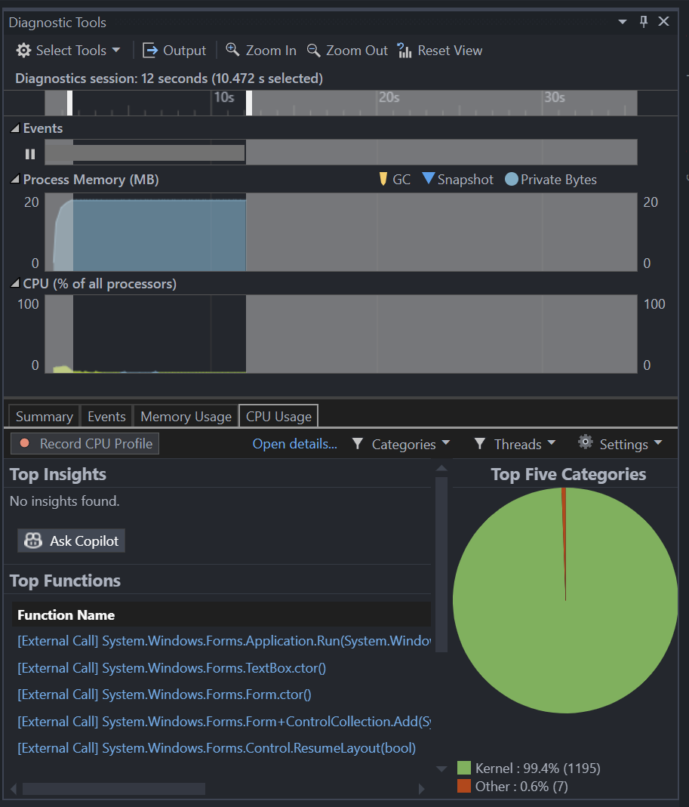

### Saat Mengetik
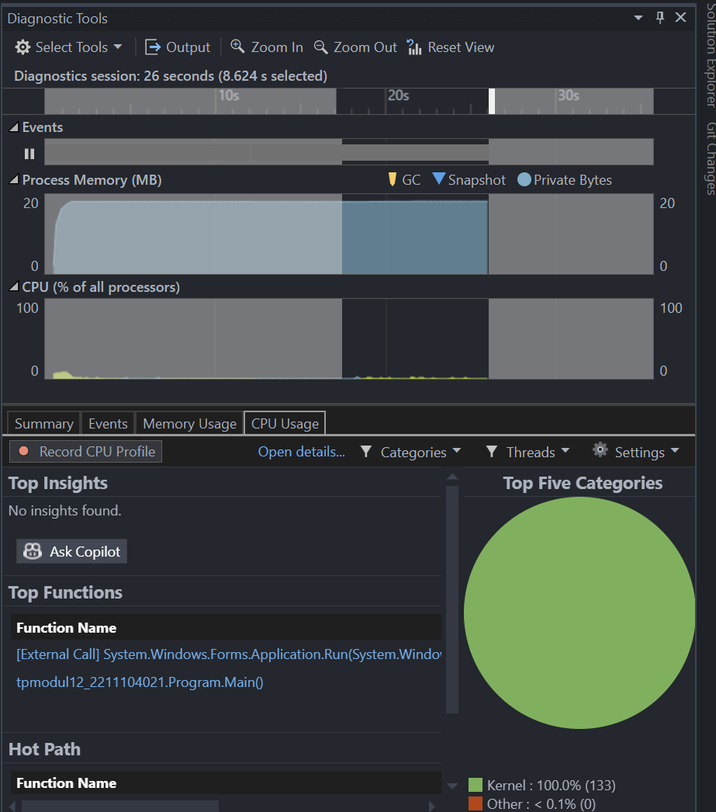

### Saat Menekan Tombol
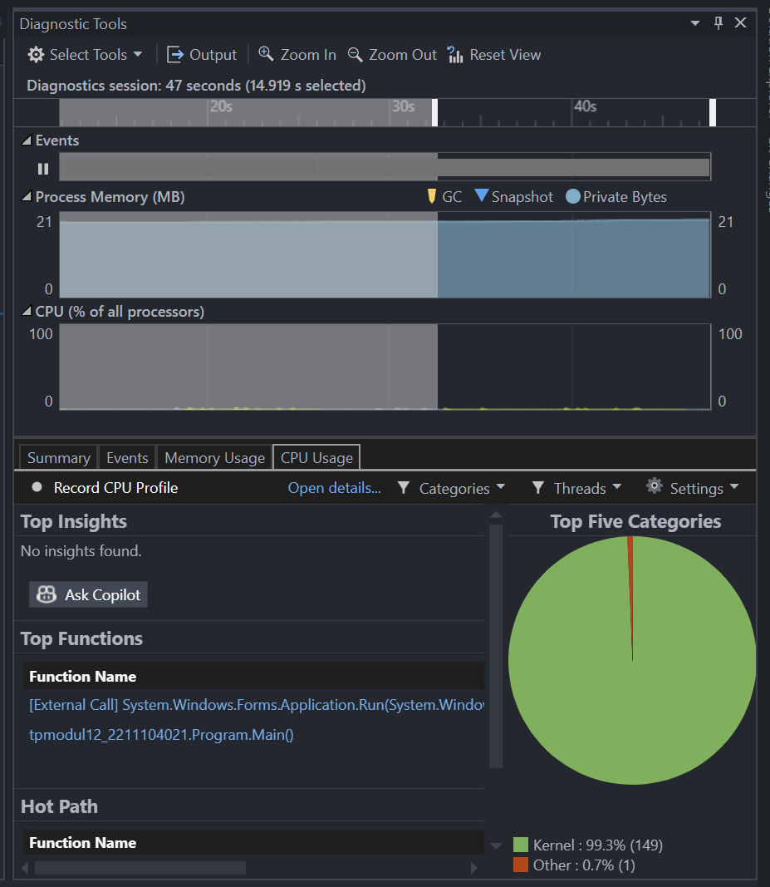


## 4. Unit Testing

### Membuat Projek Test baru
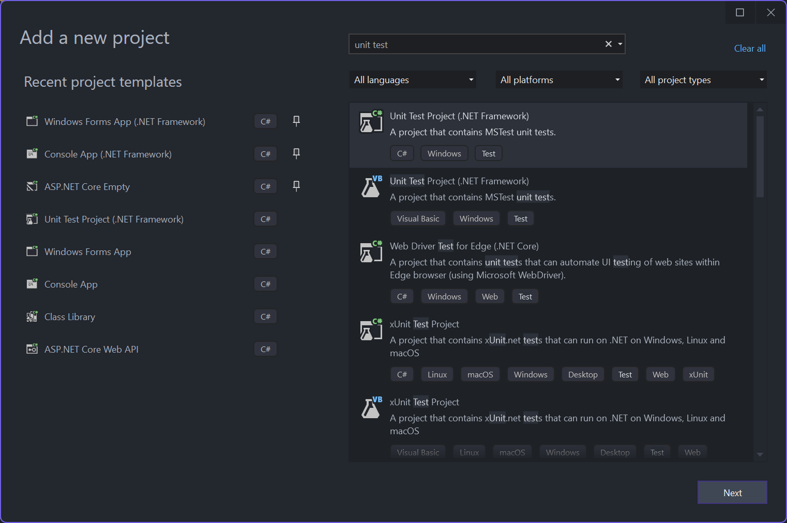
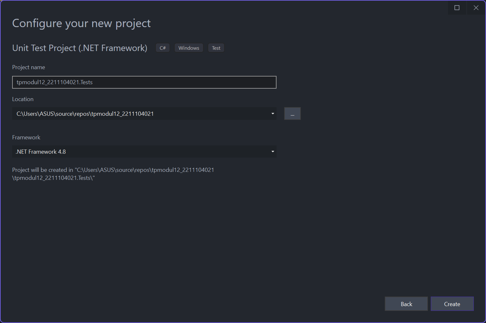

### Source Code `UnitTest1.cs`:
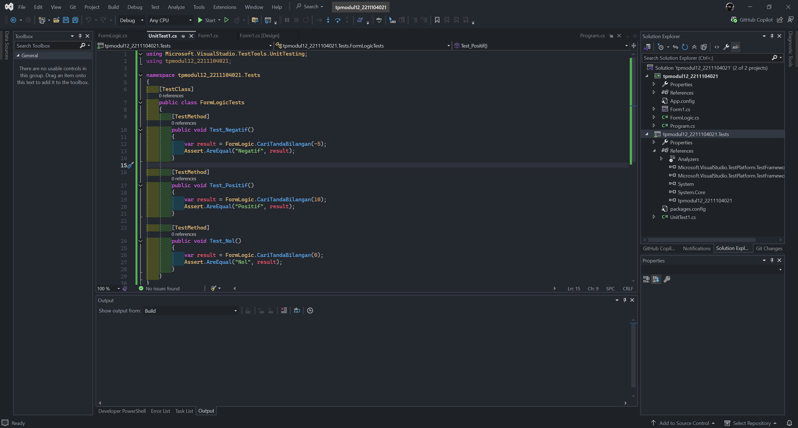

```
using Microsoft.VisualStudio.TestTools.UnitTesting;
using tpmodul12_2211104021;

namespace tpmodul12_2211104021.Tests
{
    [TestClass]
    public class FormLogicTests
    {
        [TestMethod]
        public void Test_Negatif()
        {
            var result = FormLogic.CariTandaBilangan(-5);
            Assert.AreEqual("Negatif", result);
        }

        [TestMethod]
        public void Test_Positif()
        {
            var result = FormLogic.CariTandaBilangan(10);
            Assert.AreEqual("Positif", result);
        }

        [TestMethod]
        public void Test_Nol()
        {
            var result = FormLogic.CariTandaBilangan(0);
            Assert.AreEqual("Nol", result);
        }
    }
}
```

### Hasil Testing
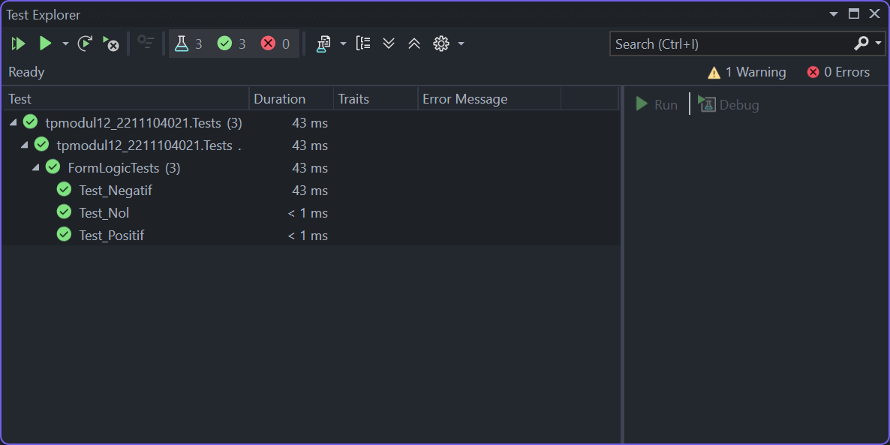
