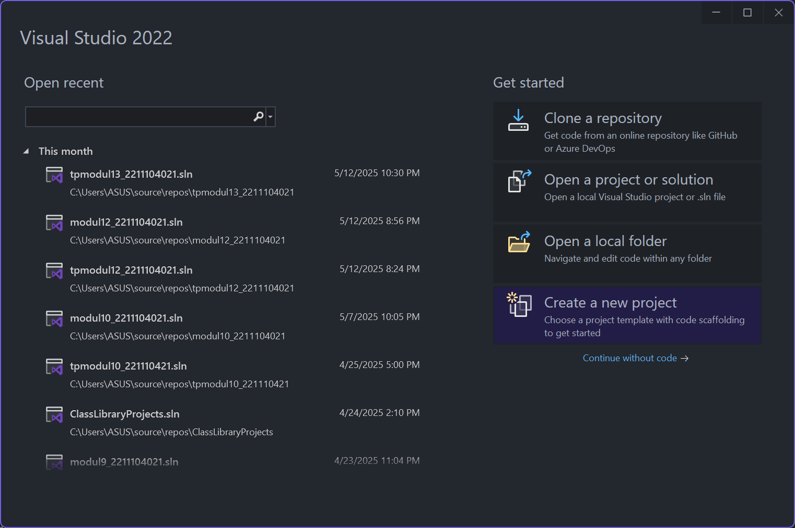
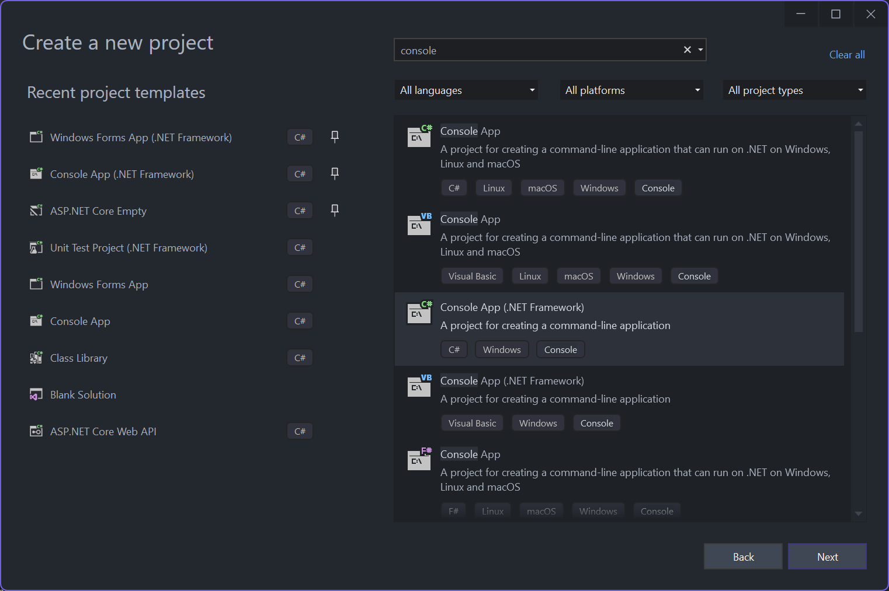
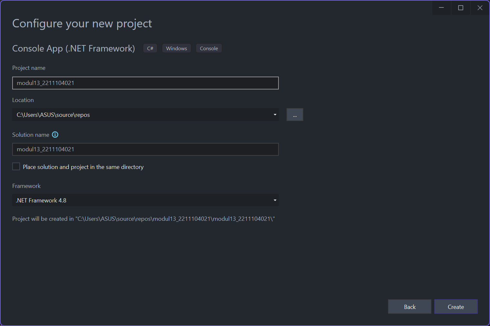
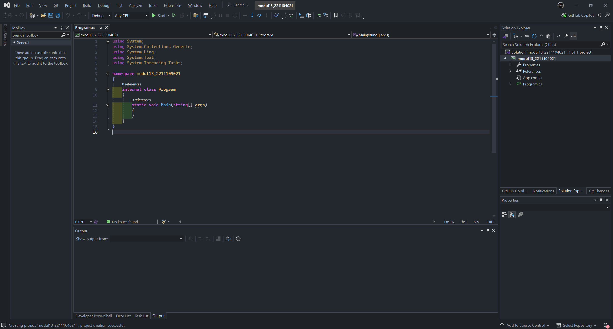
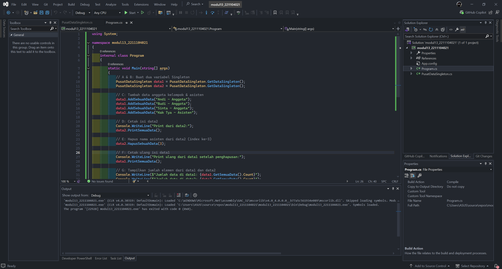
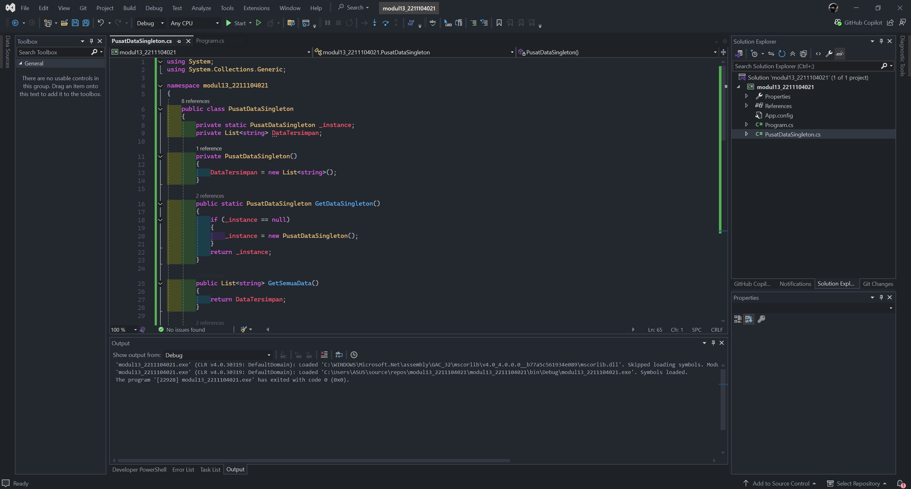
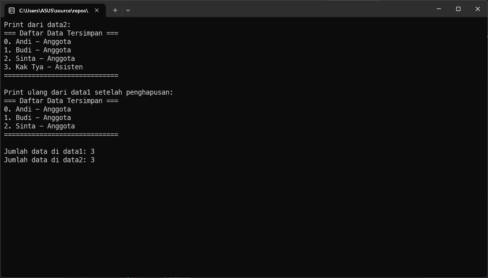

<div align="center">
JURNAL <br>
KONSTRUKSI PERANGKAT LUNAK <br>
<br>
MODUL XIII <br>
<!-- JUDUL -->
 <br>


<br>

Disusun Oleh: <br>
Wahyu Isnantia Qodri Ghozali/2211104021 <br>
SE-06-01 <br>

<br>

Asisten Praktikum : <br>
Naufal El Kamil Aditya Pratama Rahman <br>
Imelda Alfina Palupi Dewi <br>

<br>

Dosen Pengampu : <br>
Yudha Islami Sulistya, S.Kom., M.Cs <br>

<br>

PROGRAM STUDI S1 REKAYASSA PERANGKAT LUNAK <br>
FAKULTAS INFORMATIKA <br> 
TELKOM UNIVERSITY PURWOKERTO <br>

</div>

## 1. Menjawab Pertanyaan:

### A. Berikan salah dua contoh kondisi dimana design pattern “Singleton” dapat digunakan.
1. Logger (Pencatat Log) Aplikasi
   - Dalam sebuah aplikasi, sering kali dibutuhkan pencatatan log yang konsisten ke satu file atau database. Dengan menggunakan Singleton, hanya akan ada satu instance Logger yang digunakan oleh seluruh bagian aplikasi, sehingga data log tetap terpusat dan konsisten.
   
2. Konfigurasi Global Aplikasi
   - Untuk menyimpan dan mengakses konfigurasi sistem (seperti setting database, API key, atau path direktori), Singleton cocok digunakan agar semua komponen aplikasi mengakses data konfigurasi yang sama dan tidak membuat duplikat objek konfigurasi.

### B. Berikan penjelasan singkat mengenai langkah-langkah dalam mengimplementasikan design pattern “Singleton”.
1. Buat Constructor-nya Private
2. Buat Instance Statis Pribadi di Dalam Class
3. Buat Method Akses Statis

### C. Berikan tiga kelebihan dan kekurangan dari design pattern “Singleton”
- Kelebihan
  1. Kontrol Akses Global
  2. Menghemat Memori
  3. Mudah Digunakan
   
- Kelebihan
  1. Susah Diuji (Testing)
  2. Pelanggaran Prinsip SOLID
  3. Tidak Thread-Safe Secara Default

## 2. Membuat Projek Baru





### Implementasi Kode:
#### Source Code `Program.cs`:


```cs
using System;

namespace modul13_2211104021
{
    internal class Program
    {
        static void Main(string[] args)
        {
            // A & B: Buat dua variabel Singleton
            PusatDataSingleton data1 = PusatDataSingleton.GetDataSingleton();
            PusatDataSingleton data2 = PusatDataSingleton.GetDataSingleton();

            // C: Tambah data anggota kelompok & asisten
            data1.AddSebuahData("Andi - Anggota");
            data1.AddSebuahData("Budi - Anggota");
            data1.AddSebuahData("Sinta - Anggota");
            data1.AddSebuahData("Kak Tya - Asisten");

            // D: Cetak isi data2
            Console.WriteLine("Print dari data2:");
            data2.PrintSemuaData();

            // E: Hapus nama asisten dari data2 (index ke-3)
            data2.HapusSebuahData(3);

            // F: Cetak ulang isi data1
            Console.WriteLine("Print ulang dari data1 setelah penghapusan:");
            data1.PrintSemuaData();

            // G: Tampilkan jumlah elemen dari data1 dan data2
            Console.WriteLine($"Jumlah data di data1: {data1.GetSemuaData().Count}");
            Console.WriteLine($"Jumlah data di data2: {data2.GetSemuaData().Count}");

            Console.ReadLine();
        }
    }
}
```


#### Source Code `PusatDataSingleton.cs`:


```cs
using System;
using System.Collections.Generic;

namespace modul13_2211104021
{
    public class PusatDataSingleton
    {
        private static PusatDataSingleton _instance;
        private List<string> DataTersimpan;

        private PusatDataSingleton()
        {
            DataTersimpan = new List<string>();
        }

        public static PusatDataSingleton GetDataSingleton()
        {
            if (_instance == null)
            {
                _instance = new PusatDataSingleton();
            }
            return _instance;
        }

        public List<string> GetSemuaData()
        {
            return DataTersimpan;
        }

        public void PrintSemuaData()
        {
            Console.WriteLine("=== Daftar Data Tersimpan ===");
            if (DataTersimpan.Count == 0)
            {
                Console.WriteLine("[Kosong]");
            }
            else
            {
                for (int i = 0; i < DataTersimpan.Count; i++)
                {
                    Console.WriteLine($"{i}. {DataTersimpan[i]}");
                }
            }
            Console.WriteLine("=============================\n");
        }

        public void AddSebuahData(string input)
        {
            DataTersimpan.Add(input);
        }

        public void HapusSebuahData(int index)
        {
            if (index >= 0 && index < DataTersimpan.Count)
            {
                DataTersimpan.RemoveAt(index);
            }
            else
            {
                Console.WriteLine("Index tidak valid!");
            }
        }
    }
}
```

### Penjelasan
Di method `Main()` akan dibuat dua variabel `data1` dan `data2` yang keduanya memanggil `GetDataSingleton()`, sehingga mereka merujuk ke instance yang sama dari class `PusatDataSingleton`. Data anggota kelompok dan asisten ditambahkan lewat `data1`, lalu isi datanya dicetak lewat `data2` yang menunjukkan bahwa keduanya berbagi data yang sama. Setelah itu, nama asisten dihapus lewat `data2`, dan ketika `data1` mencetak ulang datanya, perubahan tersebut tetap terlihat karena mereka menggunakan instance yang sama. Terakhir, program menampilkan jumlah data di keduanya, yang akan sama, membuktikan bahwa Singleton hanya punya satu instance bersama.

## 3. Output

