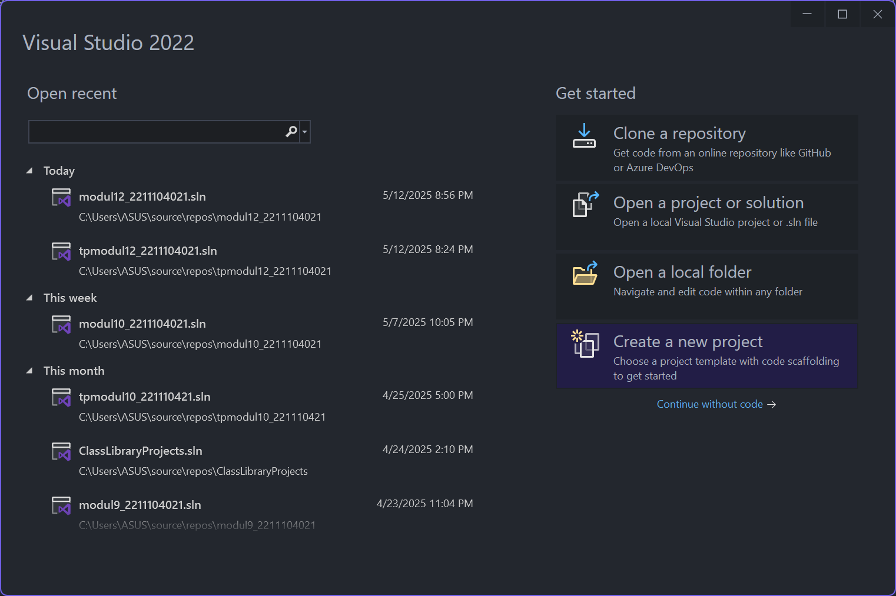
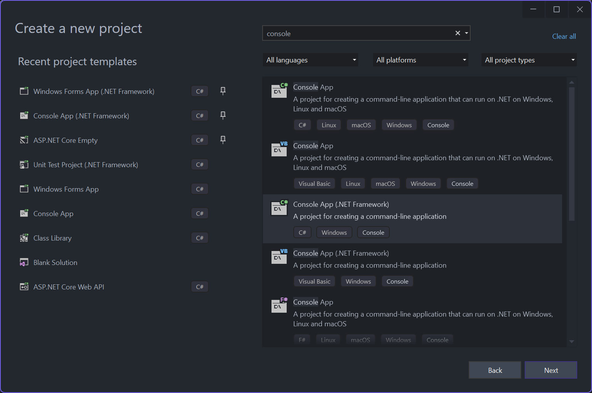
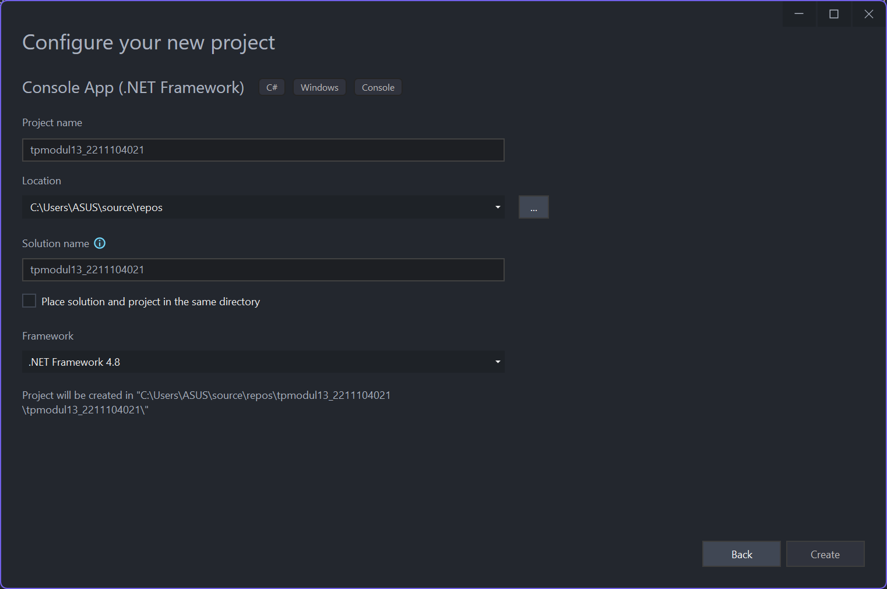
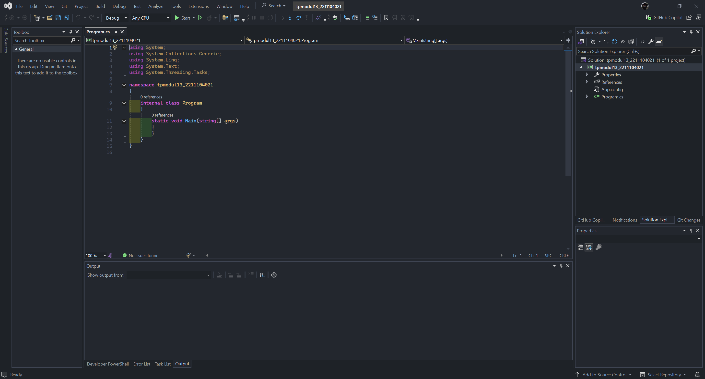
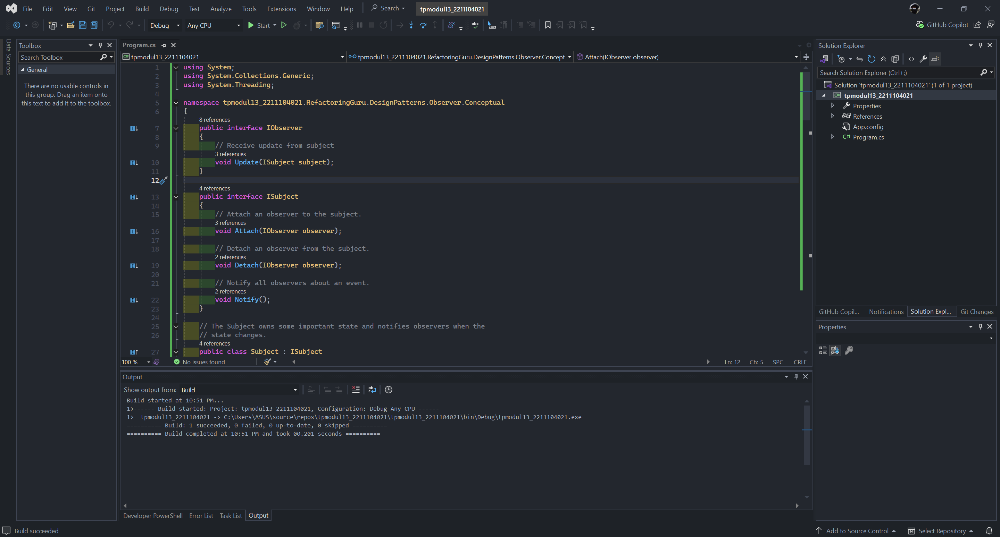
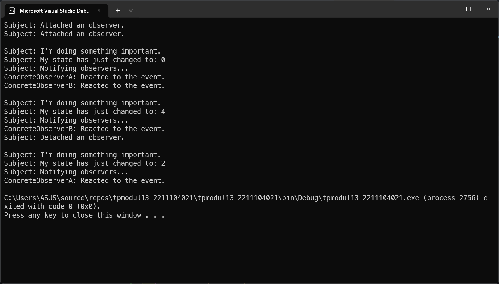

<div align="center">
TUGAS PENDAHULUAN <br>
KONSTRUKSI PERANGKAT LUNAK <br>
<br>
MODUL XIII <br>
<!-- JUDUL -->
 <br>


<br>

Disusun Oleh: <br>
Wahyu Isnantia Qodri Ghozali/2211104021 <br>
SE-06-01 <br>

<br>

Asisten Praktikum : <br>
Naufal El Kamil Aditya Pratama Rahman <br>
Imelda Alfina Palupi Dewi <br>

<br>

Dosen Pengampu : <br>
Yudha Islami Sulistya, S.Kom., M.Cs <br>

<br>

PROGRAM STUDI S1 REKAYASSA PERANGKAT LUNAK <br>
FAKULTAS INFORMATIKA <br> 
TELKOM UNIVERSITY PURWOKERTO <br>

</div>


## 1. Membuat Projek Baru





## 2. Menjawab Pertanyaan

### a. Contoh kondisi penggunaan Observer Pattern
Observer pattern cocok digunakan ketika kita memiliki satu objek (subject) yang statusnya bisa berubah, dan perubahan itu perlu memberi tahu beberapa objek lain (observers). Contohnya adalah aplikasi cuaca: ketika data cuaca (temperature, humidity, dll) diperbarui di pusat, semua tampilan UI (seperti panel suhu, panel kelembapan, dll) harus ikut berubah secara otomatis.

### b. Langkah-langkah implementasi Observer Pattern
1. Membuat interface IObserver yang memiliki method seperti Update() yang akan dijalankan saat ada perubahan dari subject.
2. Membuat interface ISubject yang berisi method Attach(IObserver observer), Detach(IObserver observer), dan Notify().
3. Implementasikan interface ISubject pada kelas Subject, yang akan menyimpan daftar observer dan memanggil Notify() setiap kali terjadi perubahan. 
4. Implementasikan interface IObserver pada setiap observer yang ingin mendapat update dari subject.
5. Daftarkan observer ke subject menggunakan Attach, lalu ketika state pada subject berubah, method Notify akan memanggil Update milik setiap observer agar mereka bisa menanggapi perubahan tersebut.

### c. Kelebihan dan Kekurangan Observer Pattern
- Kelebihannya adalah loose coupling antara subject dan observer, sehingga memudahkan dalam pengembangan modular dan scalable. Observer juga membuat notifikasi otomatis antar objek tanpa harus saling tergantung secara langsung.

<br>

- Kekurangannya, jika terlalu banyak observer atau update yang terlalu sering, bisa menimbulkan overhead dan menurunkan performa. Selain itu, debugging bisa menjadi lebih sulit karena alur notifikasi bisa menjadi kompleks.

## 3. Implementasi Kode


### Source Code `Program.cs`:

```
using System;
using System.Collections.Generic;
using System.Threading;

namespace tpmodul13_2211104021.RefactoringGuru.DesignPatterns.Observer.Conceptual
{
    public interface IObserver
    {
        // Receive update from subject
        void Update(ISubject subject);
    }

    public interface ISubject
    {
        // Attach an observer to the subject.
        void Attach(IObserver observer);

        // Detach an observer from the subject.
        void Detach(IObserver observer);

        // Notify all observers about an event.
        void Notify();
    }

    // The Subject owns some important state and notifies observers when the
    // state changes.
    public class Subject : ISubject
    {
        // For the sake of simplicity, the Subject's state, essential to all
        // subscribers, is stored in this variable.
        public int State { get; set; } = -0;

        // List of subscribers. In real life, the list of subscribers can be
        // stored more comprehensively (categorized by event type, etc.).
        private List<IObserver> _observers = new List<IObserver>();

        // The subscription management methods.
        public void Attach(IObserver observer)
        {
            Console.WriteLine("Subject: Attached an observer.");
            this._observers.Add(observer);
        }

        public void Detach(IObserver observer)
        {
            this._observers.Remove(observer);
            Console.WriteLine("Subject: Detached an observer.");
        }

        // Trigger an update in each subscriber.
        public void Notify()
        {
            Console.WriteLine("Subject: Notifying observers...");

            foreach (var observer in _observers)
            {
                observer.Update(this);
            }
        }

        // Usually, the subscription logic is only a fraction of what a Subject
        // can really do. Subjects commonly hold some important business logic,
        // that triggers a notification method whenever something important is
        // about to happen (or after it).
        public void SomeBusinessLogic()
        {
            Console.WriteLine("\nSubject: I'm doing something important.");
            this.State = new Random().Next(0, 10);

            Thread.Sleep(15);

            Console.WriteLine("Subject: My state has just changed to: " + this.State);
            this.Notify();
        }
    }

    // Concrete Observers react to the updates issued by the Subject they had
    // been attached to.
    class ConcreteObserverA : IObserver
    {
        public void Update(ISubject subject)
        {
            if ((subject as Subject).State < 3)
            {
                Console.WriteLine("ConcreteObserverA: Reacted to the event.");
            }
        }
    }

    class ConcreteObserverB : IObserver
    {
        public void Update(ISubject subject)
        {
            if ((subject as Subject).State == 0 || (subject as Subject).State >= 2)
            {
                Console.WriteLine("ConcreteObserverB: Reacted to the event.");
            }
        }
    }

    class Program
    {
        static void Main(string[] args)
        {
            // The client code.
            var subject = new Subject();
            var observerA = new ConcreteObserverA();
            subject.Attach(observerA);

            var observerB = new ConcreteObserverB();
            subject.Attach(observerB);

            subject.SomeBusinessLogic();
            subject.SomeBusinessLogic();

            subject.Detach(observerB);

            subject.SomeBusinessLogic();
        }
    }
}
```
### Penjelasan:
Di method `Main`, akan dibuat objek `Subject` sebagai sumber event, lalu dibuat dua observer yaitu `ConcreteObserverA` dan `ConcreteObserverB` yang masing-masing di-*attach* ke subject menggunakan method `Attach`, sehingga mereka akan mendapat notifikasi saat ada perubahan pada subject. Kemudian `SomeBusinessLogic` dipanggil dua kali, yang akan mengubah nilai `State` subject secara acak, dan setiap kali berubah, observer yang sudah terdaftar akan diberi tahu lewat method `Notify`, sehingga masing-masing observer bisa merespons jika kondisi tertentu terpenuhi. Setelah itu, observerB dilepas dengan method `Detach`, jadi dia tidak akan mendapat notifikasi lagi saat `SomeBusinessLogic` dipanggil untuk ketiga kalinya.

### Output
