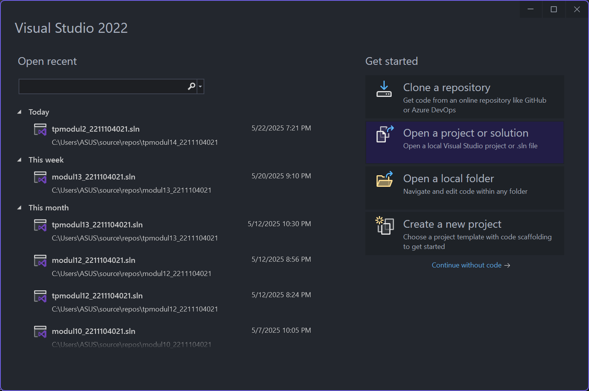
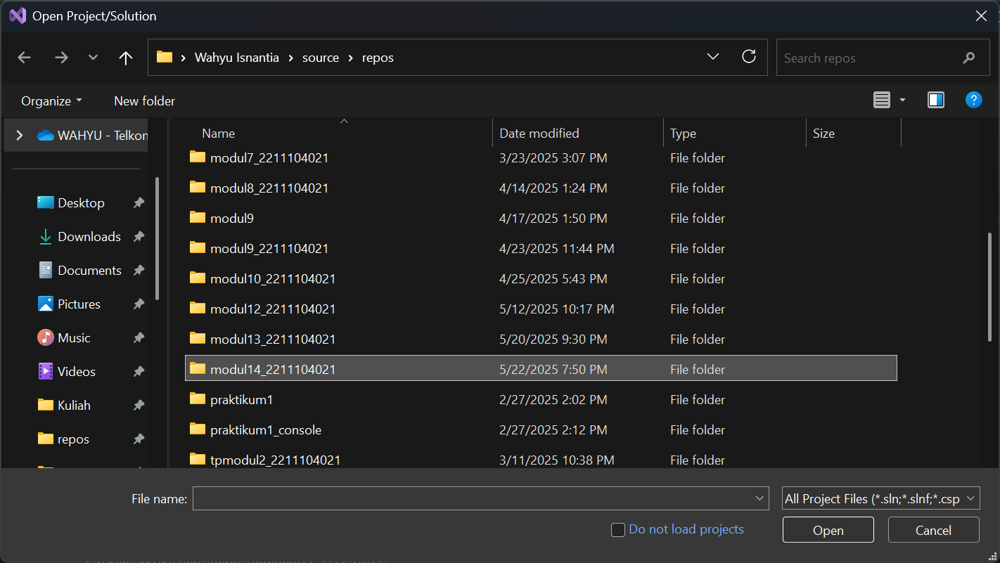
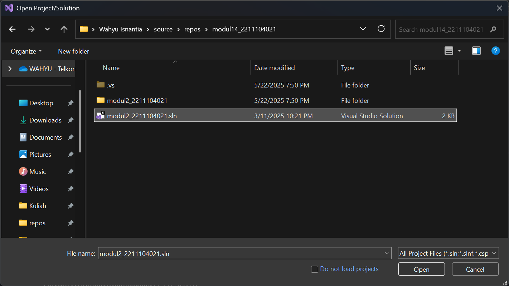
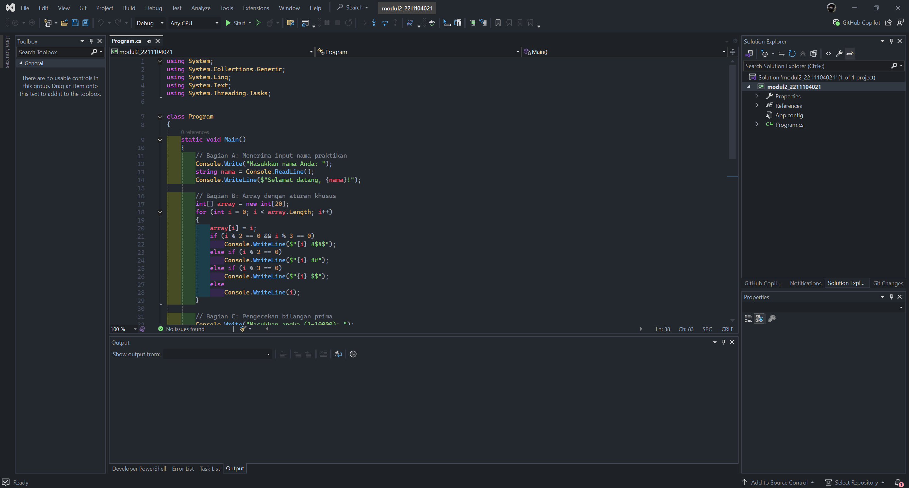
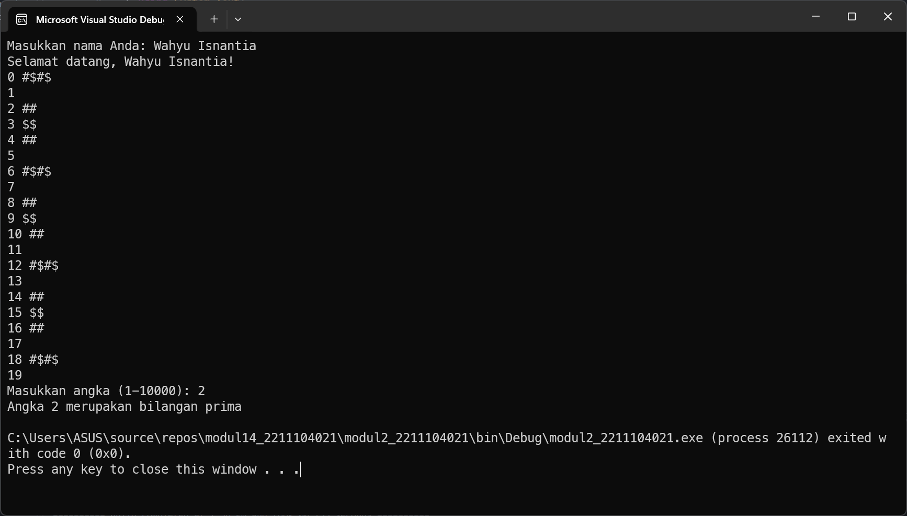
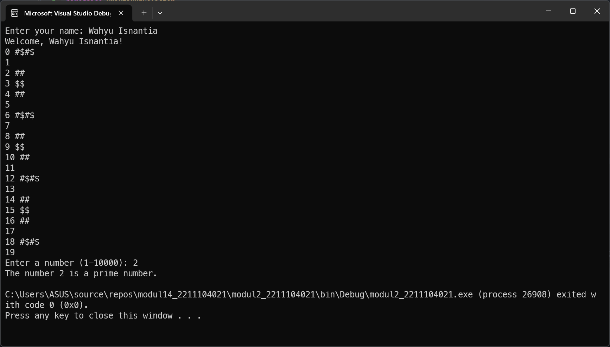

<div align="center">
JURNAL <br>
KONSTRUKSI PERANGKAT LUNAK <br>
<br>
MODUL XIV <br>
<!-- JUDUL -->
 <br>


<br>

Disusun Oleh: <br>
Wahyu Isnantia Qodri Ghozali/2211104021 <br>
SE-06-01 <br>

<br>

Asisten Praktikum : <br>
Naufal El Kamil Aditya Pratama Rahman <br>
Imelda Alfina Palupi Dewi <br>

<br>

Dosen Pengampu : <br>
Yudha Islami Sulistya, S.Kom., M.Cs <br>

<br>

PROGRAM STUDI S1 REKAYASSA PERANGKAT LUNAK <br>
FAKULTAS INFORMATIKA <br> 
TELKOM UNIVERSITY PURWOKERTO <br>

</div>

## 1. Mengcopy Jurnal Modul 2


Disini saya menggunakan tugas jurnal dari modul 2, saya copy folder tugas jurnal 2 nya lalu saya rename ke "modul14_2211104021"






## 2. Refactoring dengan standar code
### Sebelum Refactoring:
```cs
using System;
using System.Collections.Generic;
using System.Linq;
using System.Text;
using System.Threading.Tasks;

class Program
{
    static void Main()
    {
        // Bagian A: Menerima input nama praktikan
        Console.Write("Masukkan nama Anda: ");
        string nama = Console.ReadLine();
        Console.WriteLine($"Selamat datang, {nama}!");

        // Bagian B: Array dengan aturan khusus
        int[] array = new int[20];
        for (int i = 0; i < array.Length; i++)
        {
            array[i] = i;
            if (i % 2 == 0 && i % 3 == 0)
                Console.WriteLine($"{i} #$#$");
            else if (i % 2 == 0)
                Console.WriteLine($"{i} ##");
            else if (i % 3 == 0)
                Console.WriteLine($"{i} $$");
            else
                Console.WriteLine(i);
        }

        // Bagian C: Pengecekan bilangan prima
        Console.Write("Masukkan angka (1-10000): ");
        int nilaiInt = Convert.ToInt32(Console.ReadLine());

        if (IsPrima(nilaiInt))
            Console.WriteLine($"Angka {nilaiInt} merupakan bilangan prima");
        else
            Console.WriteLine($"Angka {nilaiInt} bukan merupakan bilangan prima");
    }

    static bool IsPrima(int angka)
    {
        if (angka < 2) return false;
        for (int i = 2; i * i <= angka; i++)
        {
            if (angka % i == 0) return false;
        }
        return true;
    }
}
```

### Setelah Refactoring:
```cs
using System;
using System.Collections.Generic;
using System.Linq;
using System.Text;
using System.Threading.Tasks;

namespace PraktikumRefactor
{
    class Program
    {
        /// <summary>
        /// Entry point of the application.
        /// </summary>
        static void Main()
        {
            // Section A: Input participant name
            Console.Write("Enter your name: ");
            string name = Console.ReadLine();
            Console.WriteLine($"Welcome, {name}!");

            // Section B: Display array with special rules
            PrintCustomArray();

            // Section C: Check if a number is prime
            Console.Write("Enter a number (1-10000): ");
            int inputNumber = Convert.ToInt32(Console.ReadLine());
            CheckPrimeNumber(inputNumber);
        }

        /// <summary>
        /// Prints an array of numbers from 0 to 19 with custom symbols based on conditions.
        /// </summary>
        static void PrintCustomArray()
        {
            int[] customArray = new int[20];
            for (int i = 0; i < customArray.Length; i++)
            {
                customArray[i] = i;

                if (i % 2 == 0 && i % 3 == 0)
                    Console.WriteLine($"{i} #$#$");
                else if (i % 2 == 0)
                    Console.WriteLine($"{i} ##");
                else if (i % 3 == 0)
                    Console.WriteLine($"{i} $$");
                else
                    Console.WriteLine(i);
            }
        }

        /// <summary>
        /// Checks whether a number is prime and displays the result.
        /// </summary>
        /// <param name="number">The number to check.</param>
        static void CheckPrimeNumber(int number)
        {
            if (IsPrime(number))
                Console.WriteLine($"The number {number} is a prime number.");
            else
                Console.WriteLine($"The number {number} is not a prime number.");
        }

        /// <summary>
        /// Determines whether a number is prime.
        /// </summary>
        /// <param name="number">The number to evaluate.</param>
        /// <returns>True if the number is prime, otherwise false.</returns>
        static bool IsPrime(int number)
        {
            if (number < 2) return false;

            for (int i = 2; i * i <= number; i++)
            {
                if (number % i == 0) return false;
            }

            return true;
        }
    }
}
```


### Output Sebelum Refactoring:


### Output Sesudah Refactoring:



## 3. Penjelasan refactoring mengikuti standar C# dan .NET

### 1. Menambahkan `namespace`:

#### Sebelum:
```cs
class Program
```

#### Sesudah:
```cs
namespace PraktikumRefactor
{
    class Program
```
Alasannya di standar .NET sebaiknya dibungkus dalam `namespace` agar modular.

### 2. Mengganti Nama Variable (Naming Convention):

#### Sebelum:
```cs
nama
nilaiInt
array
angka
```

#### Sesudah:
```cs
name
inputNumber
customArray
number
```
Alasannya di standar .NET menggunakan camelCase, dan menghindari nama generik seperti `array`.

### 3. Mengganti Komentar dan Komentar XML:

#### Sebelum:
```cs
// Bagian A: Menerima input nama praktikan
```

#### Sesudah:
```cs
// Section A: Input participant name
```

#### Komentar XML:
```cs
/// <summary>
/// Entry point of the application.
/// </summary>
static void Main()
```

Alasannya menggunakan bahasa inggris agar dapat dibaca developer dari internasional, terlihat lebih profesional dan XML comments digunakan untuk auto-documentation di Visual Studio.

### 4. Split Method (Refactor logic):

#### Sebelum:
- Semua kode di dalam `Main()`

#### Sesudah:
- `PrintCustomArray()`
- `CheckPrimeNumber(int number)`
- `IsPrime(int number)`


Alasannya menerapkan Single Responsibility Principle (SRP), fungsi `Main()` lebih pendek dan untuk maintain dan menambah fitur lebih mudah.

### 5. Refactor Nama Method `IsPrima` → `IsPrime`:

#### Sebelum:
```cs
static bool IsPrima(int angka)
```

#### Sesudah:
```cs
static bool IsPrime(int number)
```

Alasannya penamaan function harus pakai PascalCase dan `IsPrime` adalah istilah standar internasional.

### 6. Perbaikan Output Format:

#### Sebelum:
```cs
Console.WriteLine($"Selamat datang, {nama}!");
```

#### Sesudah:
```cs
Console.WriteLine($"Welcome, {name}!");
```

Alasannya semua teks output diubah ke bahasa Inggris agar konsisten dengan rest of code.