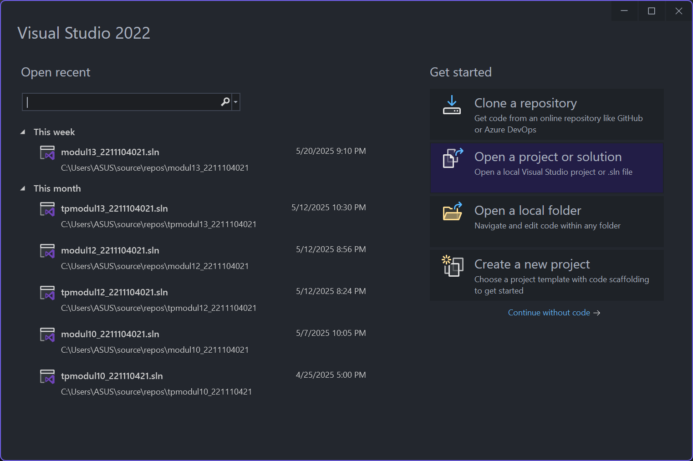
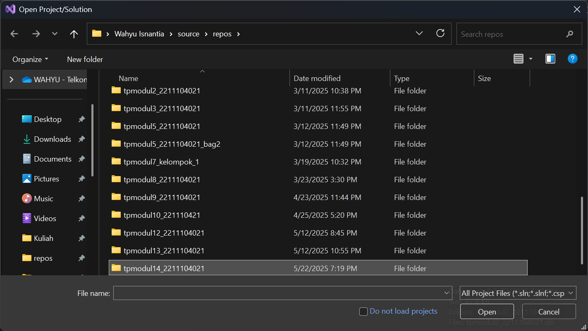
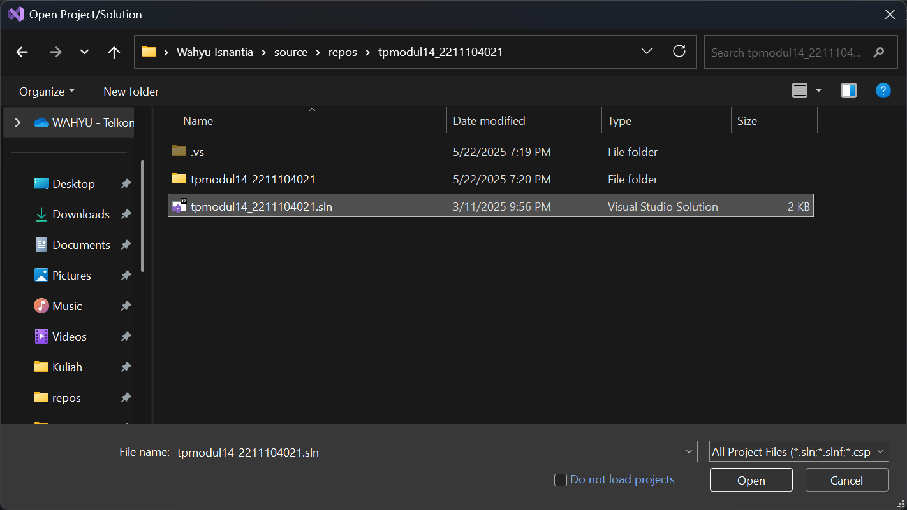
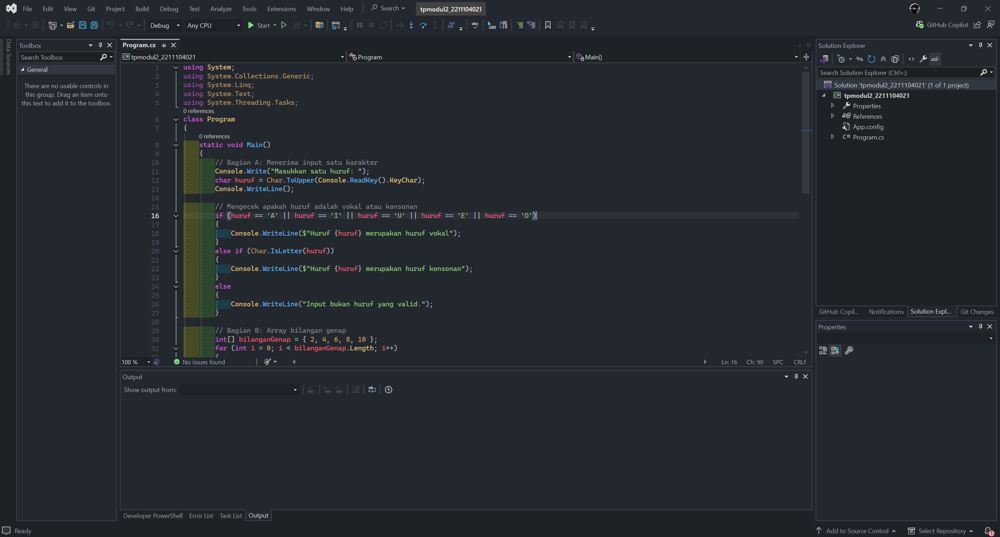
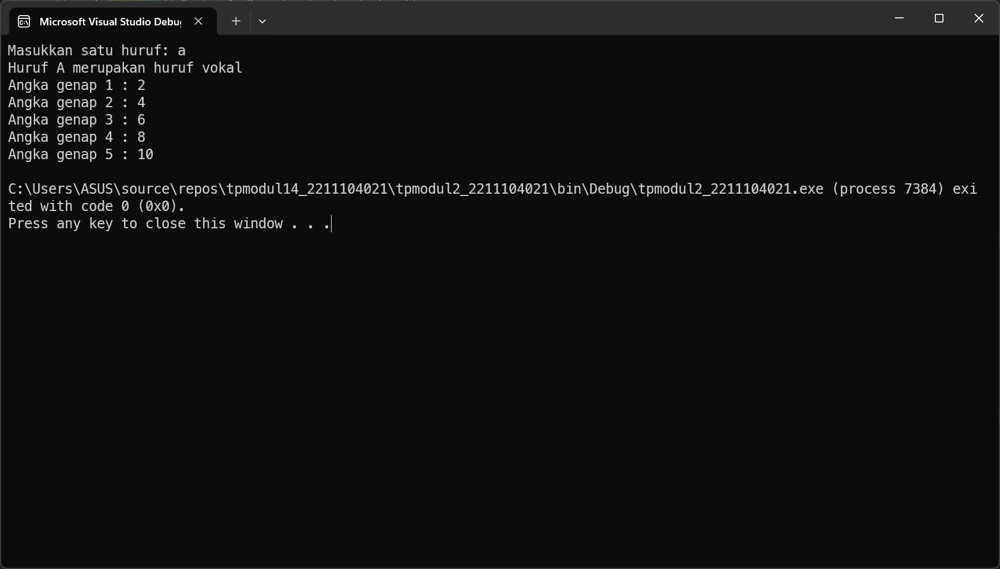

<div align="center">
TUGAS PENDAHULUAN <br>
KONSTRUKSI PERANGKAT LUNAK <br>
<br>
MODUL XIV <br>
<!-- JUDUL -->
 <br>


<br>

Disusun Oleh: <br>
Wahyu Isnantia Qodri Ghozali/2211104021 <br>
SE-06-01 <br>

<br>

Asisten Praktikum : <br>
Naufal El Kamil Aditya Pratama Rahman <br>
Imelda Alfina Palupi Dewi <br>

<br>

Dosen Pengampu : <br>
Yudha Islami Sulistya, S.Kom., M.Cs <br>

<br>

PROGRAM STUDI S1 REKAYASSA PERANGKAT LUNAK <br>
FAKULTAS INFORMATIKA <br> 
TELKOM UNIVERSITY PURWOKERTO <br>

</div>

## 1. Mengcopy TP Modul 2


Disini saya menggunakan tugas pendahuluan dari modul 2, saya copy folder tugas pendahuluan 2 nya lalu saya rename ke "tpmodul14_2211104021"






## 2. Refactoring dengan standar code
### Sebelum Refactoring:
```cs
using System;
using System.Collections.Generic;
using System.Linq;
using System.Text;
using System.Threading.Tasks;
class Program
{
    static void Main()
    {
        // Bagian A: Menerima input satu karakter
        Console.Write("Masukkan satu huruf: ");
        char huruf = Char.ToUpper(Console.ReadKey().KeyChar);
        Console.WriteLine();

        // Mengecek apakah huruf adalah vokal atau konsonan
        if (huruf == 'A' || huruf == 'I' || huruf == 'U' || huruf == 'E' || huruf == 'O')
        {
            Console.WriteLine($"Huruf {huruf} merupakan huruf vokal");
        }
        else if (Char.IsLetter(huruf))
        {
            Console.WriteLine($"Huruf {huruf} merupakan huruf konsonan");
        }
        else
        {
            Console.WriteLine("Input bukan huruf yang valid.");
        }

        // Bagian B: Array bilangan genap
        int[] bilanganGenap = { 2, 4, 6, 8, 10 };
        for (int i = 0; i < bilanganGenap.Length; i++)
        {
            Console.WriteLine($"Angka genap {i + 1} : {bilanganGenap[i]}");
        }
    }
}
```

### Setelah Refactoring:
```cs
using System;
using System.Collections.Generic;
using System.Linq;
using System.Text;
using System.Threading.Tasks;

class Program
{
    static void Main()
    {
        // Section A: Accept one character input
        Console.Write("Enter a letter: ");
        char inputChar = Char.ToUpper(Console.ReadKey().KeyChar);
        Console.WriteLine();

        // Check if the character is a vowel or consonant
        if (inputChar == 'A' || inputChar == 'I' || inputChar == 'U' || inputChar == 'E' || inputChar == 'O')
        {
            Console.WriteLine($"The letter {inputChar} is a vowel.");
        }
        else if (Char.IsLetter(inputChar))
        {
            Console.WriteLine($"The letter {inputChar} is a consonant.");
        }
        else
        {
            Console.WriteLine("Input is not a valid letter.");
        }

        // Section B: Display even numbers from array
        int[] evenNumbers = { 2, 4, 6, 8, 10 };
        for (int i = 0; i < evenNumbers.Length; i++)
        {
            Console.WriteLine($"Even number {i + 1}: {evenNumbers[i]}");
        }
    }
}
```

### Output Sebelum Refactoring:


### Output Sesudah Refactoring:


## 3. Penjelasan refactoring mengikuti standar C# dan .NET

### 1. Memberi 1 baris kosong setelah `using`:

#### Sebelum:
```cs
using System;
using System.Collections.Generic;
using System.Linq;
using System.Text;
using System.Threading.Tasks;
class Program

```

#### Sesudah:
```cs
using System;
using System.Collections.Generic;
using System.Linq;
using System.Text;
using System.Threading.Tasks;

class Program

```
Alasannya di standar .NET menganjurkan kasih satu baris kosong antara using directives dan deklarasi kelas agar lebih bersih dan terbaca rapi.

### 2. Mengganti Nama Variable (Naming Convention):

#### Sebelum:
```cs
huruf
bilanganGenap
```

#### Sesudah:
```cs
inputChar
evenNumbers
```
Alasannya menggunakan bahasa inggris agar dapat dibaca developer dari internasional, camelCase untuk mengikuti standar .NET

### 3. Mengganti Komentar:

#### Sebelum:
```cs
// Bagian A: Menerima input satu karakter
// Mengecek apakah huruf adalah vokal atau konsonan
// Bagian B: Array bilangan genap
```

#### Sesudah:
```cs
// Section A: Accept one character input
// Check if the character is a vowel or consonant
// Section B: Display even numbers from array
```
Alasannya menggunakan bahasa inggris agar dapat dibaca developer dari internasional dan terlihat lebih profesional

### 4. Penyesuaian Format Output:

#### Sebelum:
```cs
Console.WriteLine($"Huruf {huruf} merupakan huruf vokal");
```

#### Sesudah:
```cs
Console.WriteLine($"The letter {inputChar} is a vowel.");
```
Alasannya agar konsisten menggunakan bahasa inggris dan format kalimat lebih natural
