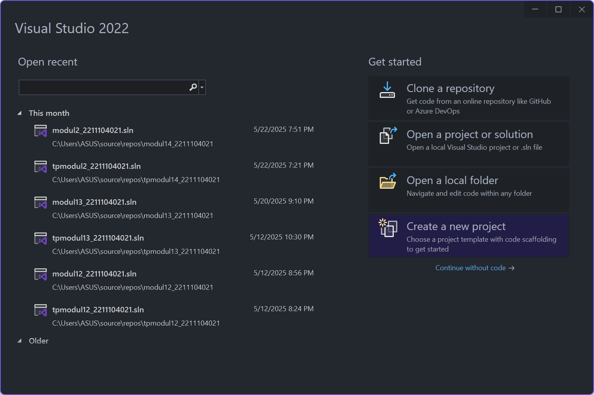
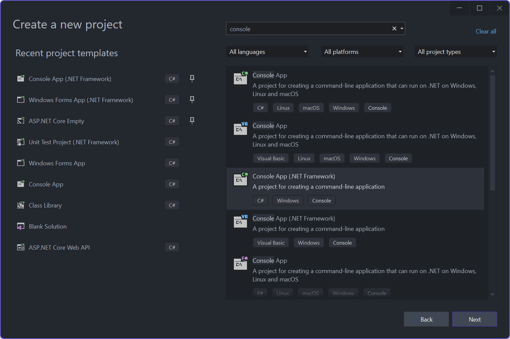
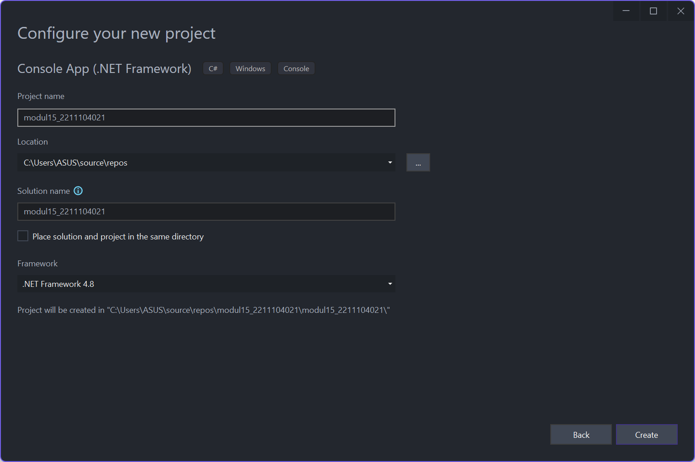
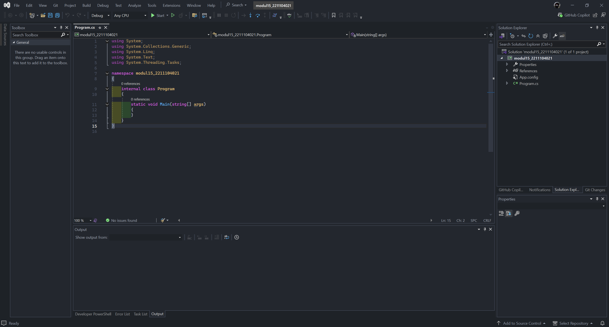
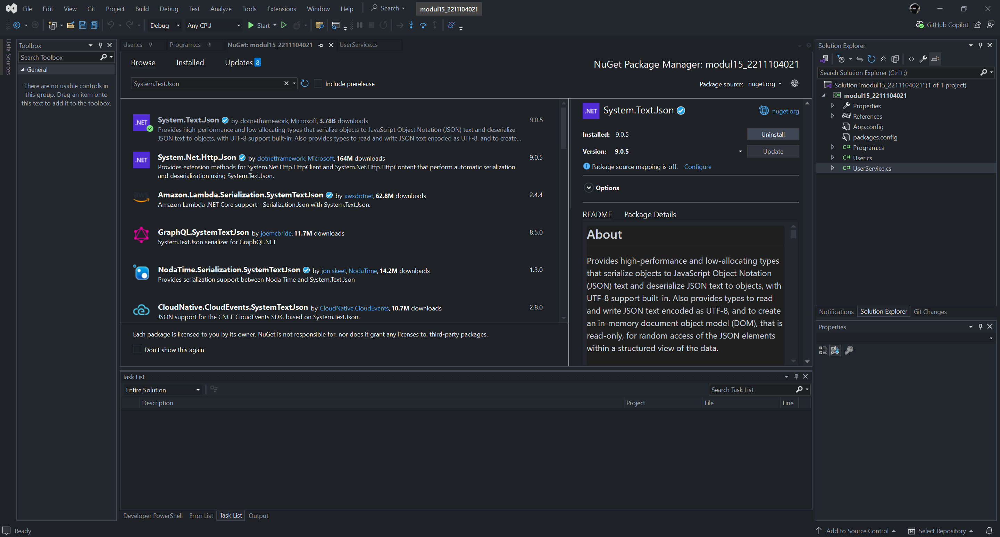
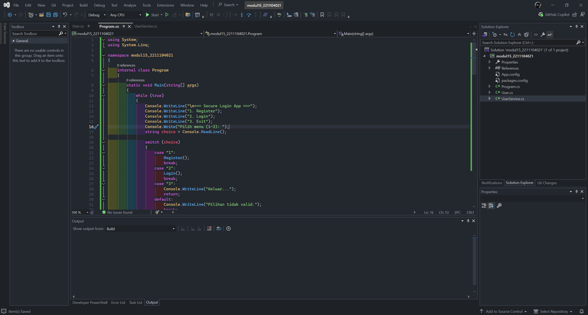
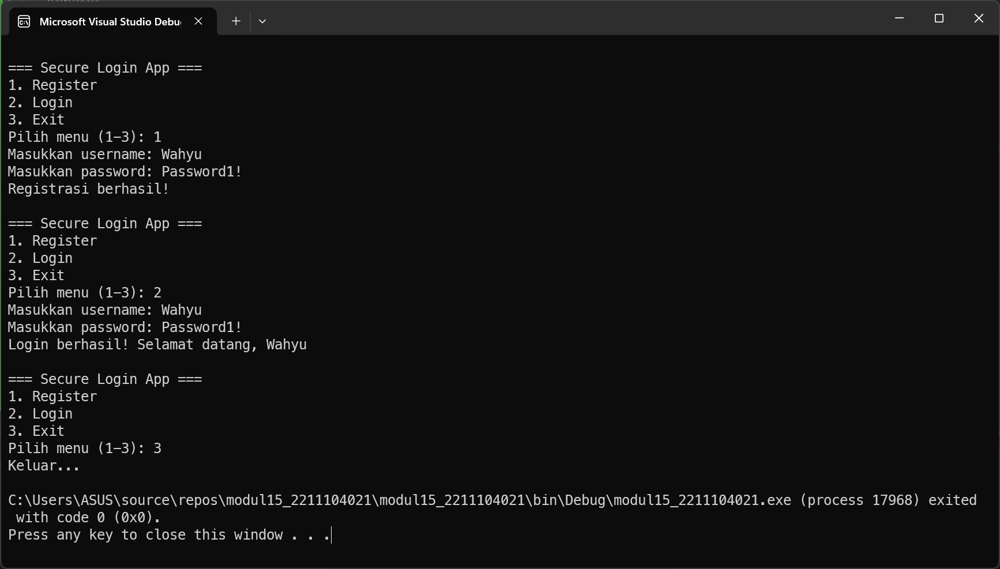
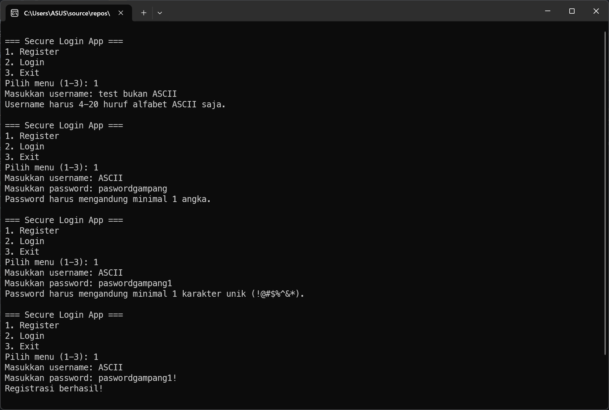
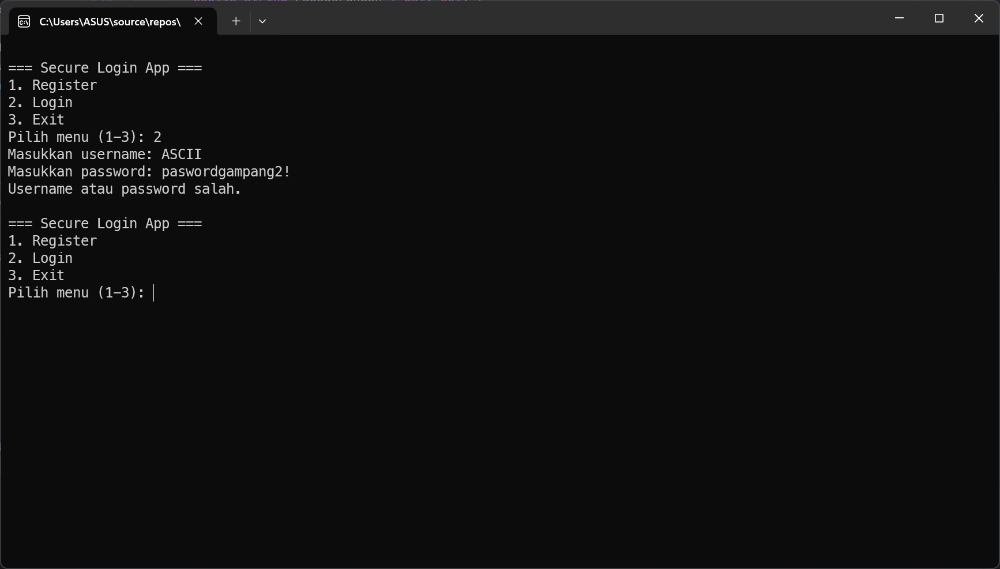
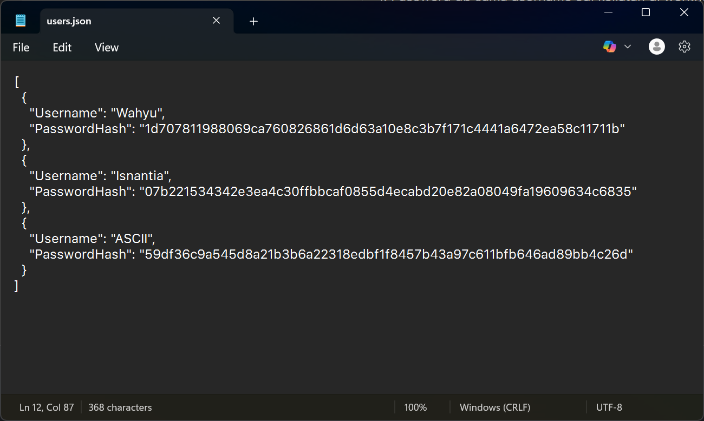

<div align="center">
JURNAL <br>
KONSTRUKSI PERANGKAT LUNAK <br>
<br>
MODUL XV <br>
<!-- JUDUL -->
 <br>


<br>

Disusun Oleh: <br>
Wahyu Isnantia Qodri Ghozali/2211104021 <br>
SE-06-01 <br>

<br>

Asisten Praktikum : <br>
Naufal El Kamil Aditya Pratama Rahman <br>
Imelda Alfina Palupi Dewi <br>

<br>

Dosen Pengampu : <br>
Yudha Islami Sulistya, S.Kom., M.Cs <br>

<br>

PROGRAM STUDI S1 REKAYASSA PERANGKAT LUNAK <br>
FAKULTAS INFORMATIKA <br> 
TELKOM UNIVERSITY PURWOKERTO <br>

</div>

## 1. Membuat Project Baru





### Menambahkan `System.Text.Json` via NuGet


## 2. Implementasi Kode


### Source code `Program.cs`:
```cs
using System;
using System.Linq;

namespace modul15_2211104021
{
    internal class Program
    {
        static void Main(string[] args)
        {
            while (true)
            {
                Console.WriteLine("\n=== Secure Login App ===");
                Console.WriteLine("1. Register");
                Console.WriteLine("2. Login");
                Console.WriteLine("3. Exit");
                Console.Write("Pilih menu (1-3): ");
                string choice = Console.ReadLine();

                switch (choice)
                {
                    case "1":
                        Register();
                        break;
                    case "2":
                        Login();
                        break;
                    case "3":
                        Console.WriteLine("Keluar...");
                        return;
                    default:
                        Console.WriteLine("Pilihan tidak valid.");
                        break;
                }
            }
        }

        static void Register()
        {
            Console.Write("Masukkan username: ");
            string username = Console.ReadLine().Trim();

            if (username.Length < 4 || username.Length > 20 || !username.All(char.IsLetter))
            {
                Console.WriteLine("Username harus 4-20 huruf alfabet ASCII saja.");
                return;
            }

            if (UserService.UsernameExists(username))
            {
                Console.WriteLine("Username sudah terdaftar.");
                return;
            }

            Console.Write("Masukkan password: ");
            string password = Console.ReadLine();

            if (!IsPasswordValid(password, username))
            {
                return;
            }

            var user = new User
            {
                Username = username,
                PasswordHash = UserService.HashPassword(password)
            };

            var users = UserService.LoadUsers();
            users.Add(user);
            UserService.SaveUsers(users);

            Console.WriteLine("Registrasi berhasil!");
        }

        static void Login()
        {
            Console.Write("Masukkan username: ");
            string username = Console.ReadLine().Trim();

            Console.Write("Masukkan password: ");
            string password = Console.ReadLine();

            if (UserService.Authenticate(username, password))
            {
                Console.WriteLine("Login berhasil! Selamat datang, " + username);
            }
            else
            {
                Console.WriteLine("Username atau password salah.");
            }
        }

        static bool IsPasswordValid(string password, string username)
        {
            if (password.Length < 8 || password.Length > 20)
            {
                Console.WriteLine("Password harus 8-20 karakter.");
                return false;
            }

            if (!password.Any(char.IsDigit))
            {
                Console.WriteLine("Password harus mengandung minimal 1 angka.");
                return false;
            }

            if (!password.Any(ch => "!@#$%^&*".Contains(ch)))
            {
                Console.WriteLine("Password harus mengandung minimal 1 karakter unik (!@#$%^&*).");
                return false;
            }

            if (password.ToLower().Contains(username.ToLower()))
            {
                Console.WriteLine("Password tidak boleh mengandung username.");
                return false;
            }

            return true;
        }
    }
}
```

### Source code `UserService.cs`:
```cs
using System;
using System.Collections.Generic;
using System.IO;
using System.Linq;
using System.Security.Cryptography;
using System.Text;
using System.Text.Json;

namespace modul15_2211104021
{
    internal class UserService
    {
        private static readonly string filePath = "users.json";

        public static List<User> LoadUsers()
        {
            if (!File.Exists(filePath)) return new List<User>();
            string json = File.ReadAllText(filePath);
            return JsonSerializer.Deserialize<List<User>>(json);
        }

        public static void SaveUsers(List<User> users)
        {
            string json = JsonSerializer.Serialize(users, new JsonSerializerOptions { WriteIndented = true });
            File.WriteAllText(filePath, json);
        }

        public static string HashPassword(string password)
        {
            using (SHA256 sha = SHA256.Create())
            {
                byte[] bytes = sha.ComputeHash(Encoding.UTF8.GetBytes(password));
                return BitConverter.ToString(bytes).Replace("-", "").ToLower();
            }
        }

        public static bool UsernameExists(string username)
        {
            return LoadUsers().Any(u => u.Username.Equals(username, StringComparison.OrdinalIgnoreCase));
        }

        public static bool Authenticate(string username, string password)
        {
            string hash = HashPassword(password);
            return LoadUsers().Any(u => u.Username == username && u.PasswordHash == hash);
        }
    }
}
```

### Source code `User.cs`:
```cs
using System;
using System.Collections.Generic;
using System.Linq;
using System.Text;
using System.Threading.Tasks;

namespace modul15_2211104021
{
    internal class User
    {
        public string Username { get; set; }
        public string PasswordHash { get; set; }
    }
}
```

### Penjelasan
Di file `Program.cs`, aplikasi dimulai dengan menampilkan menu login dan register. Saat register dipilih, input username dan password divalidasi sesuai aturan keamanan, lalu password di-hash dan disimpan ke file `users.json` lewat `UserService.cs`. Jika login dipilih, program mencocokkan input dengan data di file JSON untuk memastikan kecocokan username dan hash password. File `users.json` otomatis dibuat dan disimpan di folder build (`bin/Debug/...`) setelah registrasi berhasil.

## 3.Output
### Output CMD:
#### Register & Login


#### Register Salah


#### Login Salah


### Output `users.json`:


